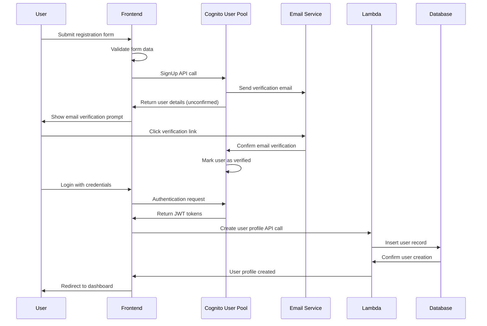
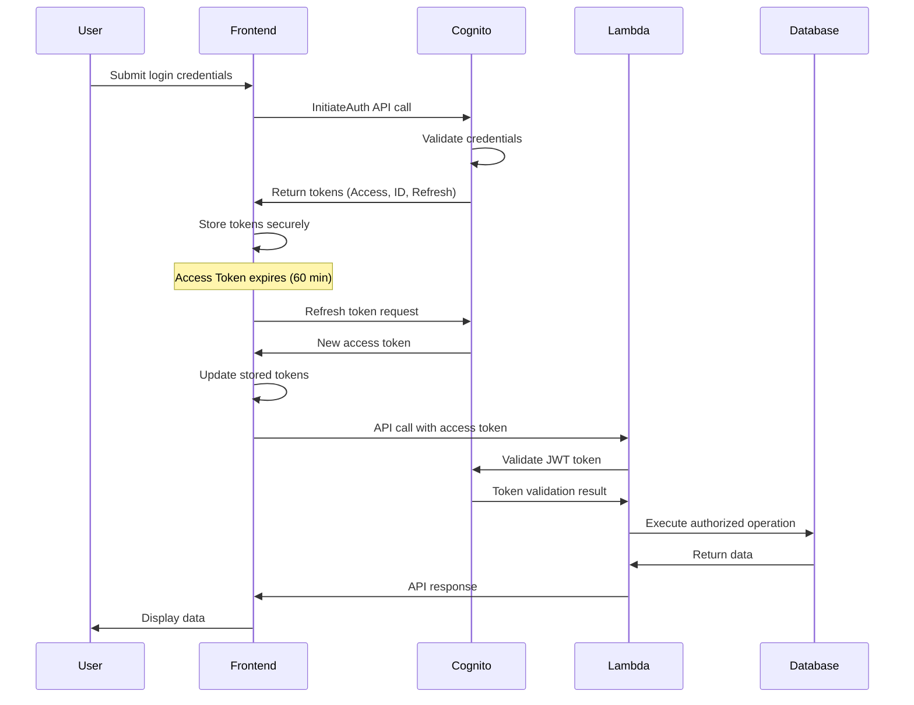
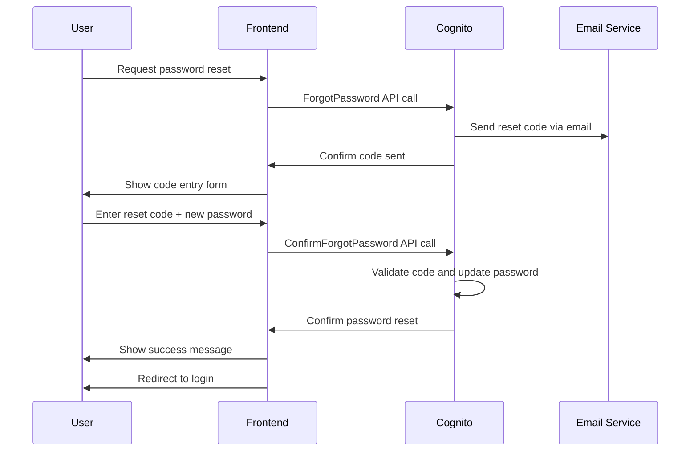

# EconLens User Authentication and Data Model

## Executive Summary

This document outlines the complete authentication architecture using AWS Cognito and the PostgreSQL database schema for EconLens. The design prioritizes security, user privacy, and scalability while maintaining simplicity for MVP development. All user data is protected with encryption at rest and in transit, with GDPR compliance built into the data model.

## AWS Cognito Configuration

### User Pool Setup

#### Basic Configuration
```json
{
  "UserPoolName": "econlens-users",
  "Policies": {
    "PasswordPolicy": {
      "MinimumLength": 12,
      "RequireUppercase": true,
      "RequireLowercase": true,
      "RequireNumbers": true,
      "RequireSymbols": true,
      "TemporaryPasswordValidityDays": 7
    }
  },
  "AutoVerifiedAttributes": ["email"],
  "AliasAttributes": ["email"],
  "UsernameAttributes": ["email"],
  "MfaConfiguration": "OPTIONAL",
  "SmsConfiguration": {
    "SnsCallerArn": "arn:aws:iam::ACCOUNT:role/service-role/CognitoUserPool_SMS_Role",
    "ExternalId": "econlens-external-id"
  }
}
```

#### Custom User Attributes
```json
{
  "Schema": [
    {
      "Name": "email",
      "AttributeDataType": "String",
      "Required": true,
      "Mutable": false
    },
    {
      "Name": "given_name", 
      "AttributeDataType": "String",
      "Required": true,
      "Mutable": true
    },
    {
      "Name": "family_name",
      "AttributeDataType": "String", 
      "Required": true,
      "Mutable": true
    },
    {
      "Name": "custom:user_type",
      "AttributeDataType": "String",
      "Required": false,
      "Mutable": true
    },
    {
      "Name": "custom:investment_experience",
      "AttributeDataType": "String",
      "Required": false,
      "Mutable": true
    },
    {
      "Name": "custom:risk_tolerance", 
      "AttributeDataType": "String",
      "Required": false,
      "Mutable": true
    }
  ]
}
```

### App Client Configuration
```json
{
  "ClientName": "econlens-web-client",
  "GenerateSecret": false,
  "RefreshTokenValidity": 30,
  "AccessTokenValidity": 60,
  "IdTokenValidity": 60,
  "TokenValidityUnits": {
    "AccessToken": "minutes",
    "IdToken": "minutes", 
    "RefreshToken": "days"
  },
  "ReadWriteAttributes": [
    "email",
    "given_name", 
    "family_name",
    "custom:user_type",
    "custom:investment_experience",
    "custom:risk_tolerance"
  ],
  "ExplicitAuthFlows": [
    "ALLOW_USER_SRP_AUTH",
    "ALLOW_REFRESH_TOKEN_AUTH",
    "ALLOW_USER_PASSWORD_AUTH"
  ]
}
```

### Identity Pool Configuration
```json
{
  "IdentityPoolName": "econlens_identity_pool",
  "AllowUnauthenticatedIdentities": false,
  "CognitoIdentityProviders": [
    {
      "ProviderName": "cognito-idp.us-east-1.amazonaws.com/us-east-1_USERPOOLID",
      "ClientId": "CLIENT_ID",
      "ServerSideTokenCheck": true
    }
  ],
  "Roles": {
    "authenticated": "arn:aws:iam::ACCOUNT:role/Cognito_EconLensAuth_Role",
    "unauthenticated": "arn:aws:iam::ACCOUNT:role/Cognito_EconLensUnauth_Role"
  }
}
```

## Authentication Flow Diagrams

### User Registration Flow


### Login and Token Management Flow


### Password Reset Flow


## PostgreSQL Database Schema

### Core Tables Overview
The database consists of 5 core tables optimized for portfolio management and scenario analysis:

1. **users** - User profile and preferences
2. **portfolios** - Portfolio definitions and metadata
3. **portfolio_assets** - Individual asset holdings
4. **scenarios** - Economic scenario definitions  
5. **scenario_results** - Calculated results and AI insights

### Table: users
```sql
CREATE TABLE users (
    id UUID PRIMARY KEY DEFAULT gen_random_uuid(),
    cognito_user_id VARCHAR(255) UNIQUE NOT NULL,
    email VARCHAR(255) UNIQUE NOT NULL,
    first_name VARCHAR(100) NOT NULL,
    last_name VARCHAR(100) NOT NULL,
    user_type VARCHAR(50) DEFAULT 'casual_investor',
    investment_experience VARCHAR(50),
    risk_tolerance VARCHAR(50),
    preferences JSONB DEFAULT '{}',
    created_at TIMESTAMP WITH TIME ZONE DEFAULT CURRENT_TIMESTAMP,
    updated_at TIMESTAMP WITH TIME ZONE DEFAULT CURRENT_TIMESTAMP,
    last_login_at TIMESTAMP WITH TIME ZONE,
    is_active BOOLEAN DEFAULT true,
    data_retention_consent BOOLEAN DEFAULT false,
    marketing_consent BOOLEAN DEFAULT false
);

-- Indexes
CREATE INDEX idx_users_cognito_id ON users(cognito_user_id);
CREATE INDEX idx_users_email ON users(email);
CREATE INDEX idx_users_created_at ON users(created_at);
CREATE INDEX idx_users_active ON users(is_active) WHERE is_active = true;

-- Trigger for updated_at
CREATE OR REPLACE FUNCTION update_updated_at_column()
RETURNS TRIGGER AS $$
BEGIN
    NEW.updated_at = CURRENT_TIMESTAMP;
    RETURN NEW;
END;
$$ LANGUAGE plpgsql;

CREATE TRIGGER update_users_updated_at 
    BEFORE UPDATE ON users 
    FOR EACH ROW EXECUTE FUNCTION update_updated_at_column();
```

### Table: portfolios
```sql
CREATE TABLE portfolios (
    id UUID PRIMARY KEY DEFAULT gen_random_uuid(),
    user_id UUID NOT NULL REFERENCES users(id) ON DELETE CASCADE,
    name VARCHAR(200) NOT NULL,
    description TEXT,
    total_value DECIMAL(15,2) NOT NULL CHECK (total_value >= 0),
    currency_code CHAR(3) DEFAULT 'USD',
    is_public BOOLEAN DEFAULT false,
    share_token VARCHAR(64) UNIQUE,
    created_at TIMESTAMP WITH TIME ZONE DEFAULT CURRENT_TIMESTAMP,
    updated_at TIMESTAMP WITH TIME ZONE DEFAULT CURRENT_TIMESTAMP,
    last_analyzed_at TIMESTAMP WITH TIME ZONE,
    analysis_count INTEGER DEFAULT 0,
    metadata JSONB DEFAULT '{}'
);

-- Indexes
CREATE INDEX idx_portfolios_user_id ON portfolios(user_id);
CREATE INDEX idx_portfolios_created_at ON portfolios(created_at);
CREATE INDEX idx_portfolios_public ON portfolios(is_public) WHERE is_public = true;
CREATE INDEX idx_portfolios_share_token ON portfolios(share_token) WHERE share_token IS NOT NULL;

-- Trigger for updated_at
CREATE TRIGGER update_portfolios_updated_at 
    BEFORE UPDATE ON portfolios 
    FOR EACH ROW EXECUTE FUNCTION update_updated_at_column();

-- Function to generate share token
CREATE OR REPLACE FUNCTION generate_share_token() 
RETURNS VARCHAR(64) AS $$
BEGIN
    RETURN encode(gen_random_bytes(32), 'hex');
END;
$$ LANGUAGE plpgsql;
```

### Table: portfolio_assets
```sql
CREATE TABLE portfolio_assets (
    id UUID PRIMARY KEY DEFAULT gen_random_uuid(),
    portfolio_id UUID NOT NULL REFERENCES portfolios(id) ON DELETE CASCADE,
    asset_symbol VARCHAR(20) NOT NULL,
    asset_name VARCHAR(200) NOT NULL,
    asset_type VARCHAR(50) NOT NULL CHECK (asset_type IN ('stock', 'bond', 'etf', 'mutual_fund', 'cash', 'commodity', 'real_estate')),
    asset_category VARCHAR(100),
    allocation_percentage DECIMAL(5,2) NOT NULL CHECK (allocation_percentage >= 0 AND allocation_percentage <= 100),
    dollar_amount DECIMAL(15,2) NOT NULL CHECK (dollar_amount >= 0),
    shares DECIMAL(15,6),
    avg_purchase_price DECIMAL(10,2),
    sector VARCHAR(100),
    geographic_region VARCHAR(100),
    created_at TIMESTAMP WITH TIME ZONE DEFAULT CURRENT_TIMESTAMP,
    updated_at TIMESTAMP WITH TIME ZONE DEFAULT CURRENT_TIMESTAMP
);

-- Indexes
CREATE INDEX idx_portfolio_assets_portfolio_id ON portfolio_assets(portfolio_id);
CREATE INDEX idx_portfolio_assets_symbol ON portfolio_assets(asset_symbol);
CREATE INDEX idx_portfolio_assets_type ON portfolio_assets(asset_type);
CREATE INDEX idx_portfolio_assets_category ON portfolio_assets(asset_category);

-- Trigger for updated_at
CREATE TRIGGER update_portfolio_assets_updated_at 
    BEFORE UPDATE ON portfolio_assets 
    FOR EACH ROW EXECUTE FUNCTION update_updated_at_column();

-- Constraint to ensure allocations sum to 100%
CREATE OR REPLACE FUNCTION check_portfolio_allocation_sum()
RETURNS TRIGGER AS $$
DECLARE
    total_allocation DECIMAL(5,2);
BEGIN
    SELECT SUM(allocation_percentage) INTO total_allocation
    FROM portfolio_assets 
    WHERE portfolio_id = COALESCE(NEW.portfolio_id, OLD.portfolio_id);
    
    IF total_allocation > 100.01 THEN
        RAISE EXCEPTION 'Total allocation percentage cannot exceed 100%%';
    END IF;
    
    RETURN COALESCE(NEW, OLD);
END;
$$ LANGUAGE plpgsql;

CREATE TRIGGER check_allocation_sum_trigger
    AFTER INSERT OR UPDATE OR DELETE ON portfolio_assets
    FOR EACH ROW EXECUTE FUNCTION check_portfolio_allocation_sum();
```

### Table: scenarios
```sql
CREATE TABLE scenarios (
    id UUID PRIMARY KEY DEFAULT gen_random_uuid(),
    name VARCHAR(200) NOT NULL UNIQUE,
    description TEXT NOT NULL,
    category VARCHAR(100) NOT NULL,
    is_predefined BOOLEAN DEFAULT true,
    created_by_user_id UUID REFERENCES users(id),
    parameters JSONB NOT NULL DEFAULT '{}',
    impact_factors JSONB NOT NULL DEFAULT '{}',
    historical_precedents TEXT[],
    severity_level INTEGER CHECK (severity_level BETWEEN 1 AND 10),
    duration_months INTEGER CHECK (duration_months > 0),
    is_active BOOLEAN DEFAULT true,
    created_at TIMESTAMP WITH TIME ZONE DEFAULT CURRENT_TIMESTAMP,
    updated_at TIMESTAMP WITH TIME ZONE DEFAULT CURRENT_TIMESTAMP
);

-- Indexes
CREATE INDEX idx_scenarios_category ON scenarios(category);
CREATE INDEX idx_scenarios_predefined ON scenarios(is_predefined) WHERE is_predefined = true;
CREATE INDEX idx_scenarios_active ON scenarios(is_active) WHERE is_active = true;
CREATE INDEX idx_scenarios_created_by ON scenarios(created_by_user_id);

-- Trigger for updated_at
CREATE TRIGGER update_scenarios_updated_at 
    BEFORE UPDATE ON scenarios 
    FOR EACH ROW EXECUTE FUNCTION update_updated_at_column();

-- Insert predefined scenarios
INSERT INTO scenarios (name, description, category, parameters, impact_factors, severity_level, duration_months) VALUES
(
    'Economic Recession',
    'Moderate economic recession with GDP decline, increased unemployment, and market volatility',
    'Economic Downturn',
    '{"gdp_change": -3.5, "unemployment_change": 2.8, "inflation_change": -0.5}',
    '{"stocks": -25, "bonds": 8, "commodities": -15, "real_estate": -18, "cash": 2}',
    7,
    18
),
(
    'Inflation Spike',
    'Rapid increase in inflation rates affecting purchasing power and asset valuations',
    'Monetary Policy',
    '{"inflation_change": 4.2, "interest_rate_change": 2.5, "dollar_strength": -8}',
    '{"stocks": -12, "bonds": -20, "commodities": 25, "real_estate": 5, "cash": -15}',
    6,
    24
);
```

### Table: scenario_results
```sql
CREATE TABLE scenario_results (
    id UUID PRIMARY KEY DEFAULT gen_random_uuid(),
    portfolio_id UUID NOT NULL REFERENCES portfolios(id) ON DELETE CASCADE,
    scenario_id UUID NOT NULL REFERENCES scenarios(id) ON DELETE CASCADE,
    user_id UUID NOT NULL REFERENCES users(id) ON DELETE CASCADE,
    calculation_results JSONB NOT NULL DEFAULT '{}',
    ai_insights JSONB NOT NULL DEFAULT '{}',
    risk_assessment TEXT,
    recommendations TEXT[],
    total_impact_percentage DECIMAL(6,2) NOT NULL,
    confidence_score INTEGER CHECK (confidence_score BETWEEN 0 AND 100),
    calculation_version VARCHAR(50) DEFAULT '1.0',
    processing_time_ms INTEGER,
    created_at TIMESTAMP WITH TIME ZONE DEFAULT CURRENT_TIMESTAMP,
    expires_at TIMESTAMP WITH TIME ZONE DEFAULT (CURRENT_TIMESTAMP + INTERVAL '90 days')
);

-- Indexes
CREATE INDEX idx_scenario_results_portfolio_id ON scenario_results(portfolio_id);
CREATE INDEX idx_scenario_results_scenario_id ON scenario_results(scenario_id);
CREATE INDEX idx_scenario_results_user_id ON scenario_results(user_id);
CREATE INDEX idx_scenario_results_created_at ON scenario_results(created_at);
CREATE INDEX idx_scenario_results_expires_at ON scenario_results(expires_at);

-- Unique constraint for caching
CREATE UNIQUE INDEX idx_scenario_results_unique_cache 
ON scenario_results(portfolio_id, scenario_id) 
WHERE expires_at > CURRENT_TIMESTAMP;

-- Cleanup expired results function
CREATE OR REPLACE FUNCTION cleanup_expired_results()
RETURNS INTEGER AS $$
DECLARE
    deleted_count INTEGER;
BEGIN
    DELETE FROM scenario_results WHERE expires_at <= CURRENT_TIMESTAMP;
    GET DIAGNOSTICS deleted_count = ROW_COUNT;
    RETURN deleted_count;
END;
$$ LANGUAGE plpgsql;
```

## Data Privacy Framework

### GDPR Compliance Implementation

#### Data Classification
| Data Type | Category | Retention Period | Encryption Required | User Access |
|-----------|----------|------------------|-------------------|-------------|
| **Authentication Data** | Personal | Account lifetime | Yes (Cognito managed) | Read-only |
| **Profile Information** | Personal | Account lifetime + 30 days | Yes | Full access |
| **Portfolio Data** | Personal/Financial | Account lifetime + 30 days | Yes | Full access |
| **Scenario Results** | Generated | 90 days (configurable) | Yes | Full access |
| **Usage Analytics** | Pseudonymized | 24 months | No | Aggregated only |
| **Support Logs** | Personal | 12 months | Yes | Upon request |

#### User Rights Implementation
```sql
-- Right to Access (Data Export)
CREATE OR REPLACE FUNCTION export_user_data(user_cognito_id VARCHAR)
RETURNS JSONB AS $$
DECLARE
    user_data JSONB;
    user_uuid UUID;
BEGIN
    SELECT id INTO user_uuid FROM users WHERE cognito_user_id = user_cognito_id;
    
    SELECT jsonb_build_object(
        'user_profile', (SELECT row_to_json(u) FROM users u WHERE u.id = user_uuid),
        'portfolios', (SELECT jsonb_agg(row_to_json(p)) FROM portfolios p WHERE p.user_id = user_uuid),
        'portfolio_assets', (SELECT jsonb_agg(row_to_json(pa)) FROM portfolio_assets pa 
                           JOIN portfolios p ON pa.portfolio_id = p.id WHERE p.user_id = user_uuid),
        'scenario_results', (SELECT jsonb_agg(row_to_json(sr)) FROM scenario_results sr WHERE sr.user_id = user_uuid)
    ) INTO user_data;
    
    RETURN user_data;
END;
$$ LANGUAGE plpgsql;

-- Right to Deletion (Account Deletion)
CREATE OR REPLACE FUNCTION delete_user_data(user_cognito_id VARCHAR)
RETURNS BOOLEAN AS $$
DECLARE
    user_uuid UUID;
BEGIN
    SELECT id INTO user_uuid FROM users WHERE cognito_user_id = user_cognito_id;
    
    IF user_uuid IS NULL THEN
        RETURN FALSE;
    END IF;
    
    -- Cascade deletion will handle related records
    DELETE FROM users WHERE id = user_uuid;
    
    RETURN TRUE;
END;
$$ LANGUAGE plpgsql;

-- Right to Rectification (Data Update with Audit Trail)
CREATE TABLE user_data_changes (
    id UUID PRIMARY KEY DEFAULT gen_random_uuid(),
    user_id UUID NOT NULL REFERENCES users(id) ON DELETE CASCADE,
    table_name VARCHAR(100) NOT NULL,
    field_name VARCHAR(100) NOT NULL,
    old_value TEXT,
    new_value TEXT,
    change_reason VARCHAR(500),
    changed_at TIMESTAMP WITH TIME ZONE DEFAULT CURRENT_TIMESTAMP
);
```

### Data Encryption Strategy

#### Application-Level Encryption
```sql
-- Encryption extension
CREATE EXTENSION IF NOT EXISTS pgcrypto;

-- Encrypted sensitive fields
ALTER TABLE portfolio_assets ADD COLUMN encrypted_notes TEXT;

-- Encryption functions
CREATE OR REPLACE FUNCTION encrypt_sensitive_data(data TEXT, user_key TEXT)
RETURNS TEXT AS $$
BEGIN
    RETURN encode(pgp_sym_encrypt(data, user_key), 'base64');
END;
$$ LANGUAGE plpgsql;

CREATE OR REPLACE FUNCTION decrypt_sensitive_data(encrypted_data TEXT, user_key TEXT)
RETURNS TEXT AS $$
BEGIN
    RETURN pgp_sym_decrypt(decode(encrypted_data, 'base64'), user_key);
EXCEPTION WHEN OTHERS THEN
    RETURN NULL;
END;
$$ LANGUAGE plpgsql;
```

## Security Implementation

### JWT Token Validation in Lambda
```javascript
const jwt = require('jsonwebtoken');
const jwksClient = require('jwks-rsa');

const client = jwksClient({
    jwksUri: `https://cognito-idp.${process.env.AWS_REGION}.amazonaws.com/${process.env.USER_POOL_ID}/.well-known/jwks.json`
});

function getKey(header, callback) {
    client.getSigningKey(header.kid, (err, key) => {
        const signingKey = key.publicKey || key.rsaPublicKey;
        callback(null, signingKey);
    });
}

exports.validateToken = async (token) => {
    return new Promise((resolve, reject) => {
        jwt.verify(token, getKey, {
            audience: process.env.USER_POOL_CLIENT_ID,
            issuer: `https://cognito-idp.${process.env.AWS_REGION}.amazonaws.com/${process.env.USER_POOL_ID}`,
            algorithms: ['RS256']
        }, (err, decoded) => {
            if (err) {
                reject(err);
            } else {
                resolve(decoded);
            }
        });
    });
};
```

### API Gateway Authorizer Configuration
```javascript
exports.handler = async (event) => {
    try {
        const token = event.authorizationToken.replace('Bearer ', '');
        const decoded = await validateToken(token);
        
        const principalId = decoded['cognito:username'];
        const effect = 'Allow';
        const resource = event.methodArn;
        
        const authResponse = {
            principalId,
            policyDocument: {
                Version: '2012-10-17',
                Statement: [{
                    Action: 'execute-api:Invoke',
                    Effect: effect,
                    Resource: resource
                }]
            },
            context: {
                userId: decoded.sub,
                email: decoded.email,
                userType: decoded['custom:user_type']
            }
        };
        
        return authResponse;
    } catch (error) {
        throw new Error('Unauthorized');
    }
};
```

### Session Management and Security Headers
```javascript
// Security headers middleware
exports.addSecurityHeaders = (event, context, callback) => {
    const response = {
        statusCode: 200,
        headers: {
            'Strict-Transport-Security': 'max-age=31536000; includeSubDomains',
            'X-Content-Type-Options': 'nosniff',
            'X-Frame-Options': 'DENY',
            'X-XSS-Protection': '1; mode=block',
            'Content-Security-Policy': "default-src 'self'; script-src 'self' 'unsafe-inline'; style-src 'self' 'unsafe-inline'",
            'Access-Control-Allow-Origin': process.env.FRONTEND_DOMAIN,
            'Access-Control-Allow-Credentials': 'true'
        }
    };
    
    callback(null, response);
};
```

## Integration Patterns

### Frontend Authentication Integration
```javascript
// AWS Amplify Auth configuration
import { Amplify, Auth } from 'aws-amplify';

Amplify.configure({
    Auth: {
        region: process.env.REACT_APP_AWS_REGION,
        userPoolId: process.env.REACT_APP_USER_POOL_ID,
        userPoolWebClientId: process.env.REACT_APP_USER_POOL_CLIENT_ID,
        identityPoolId: process.env.REACT_APP_IDENTITY_POOL_ID,
        mandatorySignIn: true,
        cookieStorage: {
            domain: process.env.REACT_APP_DOMAIN,
            path: '/',
            expires: 365,
            secure: true,
            sameSite: 'strict'
        }
    }
});

// Custom authentication hook
export const useAuth = () => {
    const [user, setUser] = useState(null);
    const [loading, setLoading] = useState(true);
    
    useEffect(() => {
        checkAuthState();
    }, []);
    
    const checkAuthState = async () => {
        try {
            const user = await Auth.currentAuthenticatedUser();
            setUser(user);
        } catch (error) {
            setUser(null);
        }
        setLoading(false);
    };
    
    return { user, loading, signIn, signOut, signUp };
};
```

### Database Connection Management in Lambda
```javascript
const { Pool } = require('pg');

let pool;

const getDbPool = () => {
    if (!pool) {
        pool = new Pool({
            host: process.env.DB_HOST,
            port: process.env.DB_PORT,
            database: process.env.DB_NAME,
            user: process.env.DB_USER,
            password: process.env.DB_PASSWORD,
            ssl: { rejectUnauthorized: false },
            max: 5,
            idleTimeoutMillis: 30000,
            connectionTimeoutMillis: 2000,
        });
    }
    return pool;
};

exports.handler = async (event) => {
    const db = getDbPool();
    
    try {
        const client = await db.connect();
        // Database operations
        const result = await client.query('SELECT * FROM users WHERE cognito_user_id = $1', [userId]);
        client.release();
        
        return {
            statusCode: 200,
            body: JSON.stringify(result.rows)
        };
    } catch (error) {
        console.error('Database error:', error);
        return {
            statusCode: 500,
            body: JSON.stringify({ error: 'Internal server error' })
        };
    }
};
```

---

**Authentication & Data Model Status**: Complete - Ready for portfolio engine and AI integration
**Next Steps**: Review portfolio calculation logic and AWS Bedrock integration in [05-Portfolio-Engine-and-AI-Scenarios.md](./05-Portfolio-Engine-and-AI-Scenarios.md)