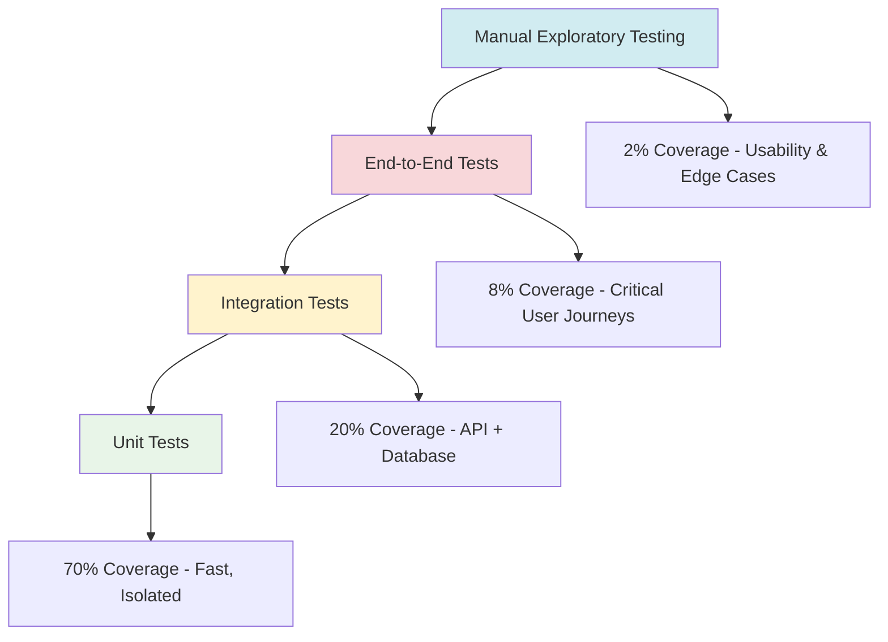

# EconLens Testing, Quality, and Launch Checklist

## Executive Summary

This document provides a comprehensive testing strategy, quality assurance framework, and launch readiness checklist for EconLens. It covers automated testing implementation, performance benchmarking, security validation, user acceptance testing, and post-launch monitoring procedures. The approach ensures reliable, performant, and secure application delivery while demonstrating professional software development practices.

## Testing Strategy Overview

### Testing Pyramid Implementation


### Quality Gates by Development Stage

#### Stage 1: Foundation Quality Gates
| Test Category | Requirement | Tools | Success Criteria |
|--------------|-------------|-------|------------------|
| **Unit Tests** | >80% code coverage | Jest, React Testing Library | All tests pass, critical functions covered |
| **Integration Tests** | API endpoints tested | Supertest, Test Containers | All CRUD operations work end-to-end |
| **Security Scan** | No high/critical vulnerabilities | npm audit, Snyk | Zero high-risk vulnerabilities |
| **Performance Baseline** | Response time measurement | Artillery, Lighthouse | <2s API response, <3s page load |
| **Accessibility** | WCAG 2.1 AA compliance | axe-core, Lighthouse | Accessibility score >90 |

#### Stage 2: Serverless Quality Gates  
| Test Category | Requirement | Tools | Success Criteria |
|--------------|-------------|-------|------------------|
| **Lambda Testing** | Function-level testing | AWS SAM, LocalStack | All Lambda functions tested in isolation |
| **API Gateway Testing** | End-to-end API testing | Postman, Newman | All endpoints return correct responses |
| **Load Testing** | Concurrent user handling | Artillery, AWS Load Testing | Handle 100 concurrent users |
| **Error Handling** | Graceful error responses | Custom test suite | All error scenarios covered |
| **Cost Validation** | AWS cost within limits | AWS Cost Explorer | Monthly costs <$50 |

#### Stage 3: AI Integration Quality Gates
| Test Category | Requirement | Tools | Success Criteria |
|--------------|-------------|-------|------------------|
| **AI Quality Testing** | Response coherence | Custom validation suite | >90% relevant AI responses |
| **Async Processing** | Queue reliability | SQS testing tools | 99%+ message processing success |
| **Cache Performance** | Response time improvement | Redis benchmarking | >70% cache hit rate |
| **Data Accuracy** | Calculation validation | Historical backtesting | <5% variance from expected results |
| **User Experience** | Complete workflow testing | Cypress, Selenium | Full scenario analysis workflow works |

#### Stage 4: Production Quality Gates
| Test Category | Requirement | Tools | Success Criteria |
|--------------|-------------|-------|------------------|
| **Infrastructure Tests** | CDK stack validation | CDK unit tests | All stacks deploy successfully |
| **Security Hardening** | Comprehensive security scan | AWS Config, Security Hub | Pass all security compliance checks |
| **Disaster Recovery** | Backup/restore procedures | Manual testing | <4 hour recovery time objective |
| **Monitoring Validation** | Alert system testing | CloudWatch, SNS | All critical alerts working |
| **Performance Under Load** | Production load simulation | Load testing tools | Handle 500+ concurrent users |

## Automated Testing Implementation

### Unit Testing Framework
```javascript
// jest.config.js
module.exports = {
  testEnvironment: 'node',
  collectCoverageFrom: [
    'src/**/*.{js,ts}',
    '!src/**/*.d.ts',
    '!src/**/*.test.{js,ts}',
    '!src/test-utils/**/*',
  ],
  coverageThreshold: {
    global: {
      branches: 80,
      functions: 80,
      lines: 80,
      statements: 80,
    },
  },
  setupFilesAfterEnv: ['<rootDir>/src/test-utils/setup.js'],
  testMatch: [
    '<rootDir>/src/**/__tests__/**/*.{js,ts}',
    '<rootDir>/src/**/*.{test,spec}.{js,ts}',
  ],
};
```

#### Backend Unit Tests Example
```javascript
// backend/src/services/__tests__/portfolio-service.test.js
const PortfolioService = require('../portfolio-service');
const { DatabaseManager } = require('../../database/connection');
const { validatePortfolio } = require('../../utils/validation');

// Mock dependencies
jest.mock('../../database/connection');
jest.mock('../../utils/validation');

describe('PortfolioService', () => {
  let portfolioService;
  let mockDb;

  beforeEach(() => {
    mockDb = {
      query: jest.fn(),
      beginTransaction: jest.fn(),
      commit: jest.fn(),
      rollback: jest.fn(),
    };
    DatabaseManager.getConnection.mockResolvedValue(mockDb);
    portfolioService = new PortfolioService();
  });

  afterEach(() => {
    jest.clearAllMocks();
  });

  describe('createPortfolio', () => {
    const validPortfolioData = {
      name: 'Test Portfolio',
      totalValue: 100000,
      assets: [
        {
          symbol: 'VTI',
          allocationPercentage: 60,
          dollarAmount: 60000,
        },
        {
          symbol: 'BND', 
          allocationPercentage: 40,
          dollarAmount: 40000,
        },
      ],
    };

    it('should create portfolio successfully with valid data', async () => {
      // Arrange
      validatePortfolio.mockReturnValue({ isValid: true });
      mockDb.query
        .mockResolvedValueOnce({ insertId: 'portfolio-uuid' }) // Portfolio insert
        .mockResolvedValueOnce({ affectedRows: 2 }); // Assets insert

      // Act
      const result = await portfolioService.createPortfolio('user-id', validPortfolioData);

      // Assert
      expect(validatePortfolio).toHaveBeenCalledWith(validPortfolioData);
      expect(mockDb.beginTransaction).toHaveBeenCalled();
      expect(mockDb.commit).toHaveBeenCalled();
      expect(result).toEqual({
        id: 'portfolio-uuid',
        name: 'Test Portfolio',
        totalValue: 100000,
      });
    });

    it('should rollback transaction on asset insertion failure', async () => {
      // Arrange
      validatePortfolio.mockReturnValue({ isValid: true });
      mockDb.query
        .mockResolvedValueOnce({ insertId: 'portfolio-uuid' })
        .mockRejectedValueOnce(new Error('Asset insertion failed'));

      // Act & Assert
      await expect(
        portfolioService.createPortfolio('user-id', validPortfolioData)
      ).rejects.toThrow('Asset insertion failed');
      
      expect(mockDb.rollback).toHaveBeenCalled();
      expect(mockDb.commit).not.toHaveBeenCalled();
    });

    it('should reject invalid portfolio data', async () => {
      // Arrange
      validatePortfolio.mockReturnValue({ 
        isValid: false, 
        errors: ['Total allocation must equal 100%'] 
      });

      // Act & Assert
      await expect(
        portfolioService.createPortfolio('user-id', { ...validPortfolioData, totalValue: -100 })
      ).rejects.toThrow('Portfolio validation failed');
      
      expect(mockDb.query).not.toHaveBeenCalled();
    });
  });

  describe('calculateScenarioImpact', () => {
    it('should calculate correct portfolio impact for recession scenario', async () => {
      // Arrange
      const portfolioId = 'portfolio-uuid';
      const scenarioId = 'recession_moderate';
      const mockPortfolio = {
        assets: [
          { category: 'domestic_equity', allocationPercentage: 60, dollarAmount: 60000 },
          { category: 'government_bonds', allocationPercentage: 40, dollarAmount: 40000 },
        ],
      };
      const mockScenario = {
        asset_impact_factors: {
          domestic_equity: { impact_range: [-35, -15] },
          government_bonds: { impact_range: [5, 15] },
        },
      };

      mockDb.query
        .mockResolvedValueOnce({ rows: [mockPortfolio] })
        .mockResolvedValueOnce({ rows: [mockScenario] });

      // Act
      const result = await portfolioService.calculateScenarioImpact(portfolioId, scenarioId);

      // Assert
      expect(result.totalImpactPercentage).toBeCloseTo(-9, 1); // 60% * -25% + 40% * 10%
      expect(result.assetImpacts).toHaveLength(2);
      expect(result.confidenceScore).toBeGreaterThan(0);
    });
  });
});
```

#### Frontend Unit Tests Example
```javascript
// src/components/__tests__/PortfolioForm.test.tsx
import React from 'react';
import { render, screen, fireEvent, waitFor } from '@testing-library/react';
import userEvent from '@testing-library/user-event';
import { Provider } from 'react-redux';
import { configureStore } from '@reduxjs/toolkit';
import PortfolioForm from '../PortfolioForm';
import portfolioReducer from '../../store/portfolioSlice';

const createTestStore = (initialState = {}) => {
  return configureStore({
    reducer: {
      portfolios: portfolioReducer,
    },
    preloadedState: initialState,
  });
};

const renderWithStore = (component: React.ReactElement, initialState = {}) => {
  const store = createTestStore(initialState);
  return {
    ...render(<Provider store={store}>{component}</Provider>),
    store,
  };
};

describe('PortfolioForm', () => {
  const mockOnSubmit = jest.fn();
  const mockOnCancel = jest.fn();

  beforeEach(() => {
    jest.clearAllMocks();
  });

  it('should render form with all required fields', () => {
    renderWithStore(<PortfolioForm onSubmit={mockOnSubmit} onCancel={mockOnCancel} />);

    expect(screen.getByLabelText(/portfolio name/i)).toBeInTheDocument();
    expect(screen.getByLabelText(/total value/i)).toBeInTheDocument();
    expect(screen.getByRole('button', { name: /create portfolio/i })).toBeInTheDocument();
    expect(screen.getByRole('button', { name: /cancel/i })).toBeInTheDocument();
  });

  it('should validate required fields before submission', async () => {
    const user = userEvent.setup();
    renderWithStore(<PortfolioForm onSubmit={mockOnSubmit} onCancel={mockOnCancel} />);

    const submitButton = screen.getByRole('button', { name: /create portfolio/i });
    await user.click(submitButton);

    expect(screen.getByText(/portfolio name is required/i)).toBeInTheDocument();
    expect(screen.getByText(/total value must be greater than 0/i)).toBeInTheDocument();
    expect(mockOnSubmit).not.toHaveBeenCalled();
  });

  it('should validate asset allocation sums to 100%', async () => {
    const user = userEvent.setup();
    renderWithStore(<PortfolioForm onSubmit={mockOnSubmit} onCancel={mockOnCancel} />);

    // Fill in basic portfolio info
    await user.type(screen.getByLabelText(/portfolio name/i), 'Test Portfolio');
    await user.type(screen.getByLabelText(/total value/i), '100000');

    // Add assets with incorrect allocation
    await user.click(screen.getByRole('button', { name: /add asset/i }));
    
    const symbolInput = screen.getByLabelText(/symbol/i);
    const allocationInput = screen.getByLabelText(/allocation/i);
    
    await user.type(symbolInput, 'VTI');
    await user.type(allocationInput, '50'); // Only 50%, should trigger validation error

    await user.click(screen.getByRole('button', { name: /create portfolio/i }));

    await waitFor(() => {
      expect(screen.getByText(/total allocation must equal 100%/i)).toBeInTheDocument();
    });
  });

  it('should submit form with valid data', async () => {
    const user = userEvent.setup();
    renderWithStore(<PortfolioForm onSubmit={mockOnSubmit} onCancel={mockOnCancel} />);

    // Fill in valid portfolio data
    await user.type(screen.getByLabelText(/portfolio name/i), 'Growth Portfolio');
    await user.type(screen.getByLabelText(/total value/i), '75000');

    // Add first asset
    await user.click(screen.getByRole('button', { name: /add asset/i }));
    
    const symbolInputs = screen.getAllByLabelText(/symbol/i);
    const allocationInputs = screen.getAllByLabelText(/allocation/i);
    const dollarInputs = screen.getAllByLabelText(/dollar amount/i);

    await user.type(symbolInputs[0], 'VTI');
    await user.type(allocationInputs[0], '60');
    await user.type(dollarInputs[0], '45000');

    // Add second asset
    await user.click(screen.getByRole('button', { name: /add asset/i }));
    
    await user.type(symbolInputs[1], 'BND');
    await user.type(allocationInputs[1], '40');
    await user.type(dollarInputs[1], '30000');

    await user.click(screen.getByRole('button', { name: /create portfolio/i }));

    await waitFor(() => {
      expect(mockOnSubmit).toHaveBeenCalledWith({
        name: 'Growth Portfolio',
        totalValue: 75000,
        assets: [
          { symbol: 'VTI', allocationPercentage: 60, dollarAmount: 45000 },
          { symbol: 'BND', allocationPercentage: 40, dollarAmount: 30000 },
        ],
      });
    });
  });
});
```

### Integration Testing Framework
```javascript
// test/integration/portfolio-api.test.js
const request = require('supertest');
const app = require('../../src/app');
const { DatabaseManager } = require('../../src/database/connection');
const { createTestUser, cleanupTestData } = require('../test-utils/helpers');

describe('Portfolio API Integration Tests', () => {
  let testUser;
  let authToken;

  beforeAll(async () => {
    // Set up test database connection
    await DatabaseManager.initialize();
    
    // Create test user and get auth token
    testUser = await createTestUser({
      email: 'test@example.com',
      firstName: 'Test',
      lastName: 'User',
    });
    
    const loginResponse = await request(app)
      .post('/api/v1/auth/login')
      .send({
        email: 'test@example.com',
        password: 'TestPassword123!',
      });
    
    authToken = loginResponse.body.accessToken;
  });

  afterAll(async () => {
    await cleanupTestData();
    await DatabaseManager.close();
  });

  describe('POST /api/v1/portfolios', () => {
    it('should create portfolio with valid data', async () => {
      const portfolioData = {
        name: 'Integration Test Portfolio',
        totalValue: 100000,
        assets: [
          {
            symbol: 'VTI',
            name: 'Vanguard Total Stock Market ETF',
            type: 'etf',
            category: 'domestic_equity',
            allocationPercentage: 70,
            dollarAmount: 70000,
          },
          {
            symbol: 'BND',
            name: 'Vanguard Total Bond Market ETF',
            type: 'etf',  
            category: 'government_bonds',
            allocationPercentage: 30,
            dollarAmount: 30000,
          },
        ],
      };

      const response = await request(app)
        .post('/api/v1/portfolios')
        .set('Authorization', `Bearer ${authToken}`)
        .send(portfolioData)
        .expect(201);

      expect(response.body).toMatchObject({
        id: expect.any(String),
        name: 'Integration Test Portfolio',
        totalValue: 100000,
      });

      expect(response.body.validationResults).toMatchObject({
        allocationSum: 100,
        dollarConsistency: true,
      });
    });

    it('should reject unauthorized requests', async () => {
      const portfolioData = {
        name: 'Unauthorized Portfolio',
        totalValue: 50000,
        assets: [],
      };

      await request(app)
        .post('/api/v1/portfolios')
        .send(portfolioData)
        .expect(401);
    });
  });

  describe('POST /api/v1/portfolios/:id/scenarios/:scenarioId/analyze', () => {
    let portfolioId;

    beforeEach(async () => {
      // Create a test portfolio for scenario analysis
      const portfolioResponse = await request(app)
        .post('/api/v1/portfolios')
        .set('Authorization', `Bearer ${authToken}`)
        .send({
          name: 'Scenario Test Portfolio',
          totalValue: 100000,
          assets: [
            {
              symbol: 'SPY',
              name: 'SPDR S&P 500 ETF',
              type: 'etf',
              category: 'domestic_equity',
              allocationPercentage: 100,
              dollarAmount: 100000,
            },
          ],
        });

      portfolioId = portfolioResponse.body.id;
    });

    it('should start scenario analysis successfully', async () => {
      const response = await request(app)
        .post(`/api/v1/portfolios/${portfolioId}/scenarios/recession_moderate/analyze`)
        .set('Authorization', `Bearer ${authToken}`)
        .send({
          includeAiInsights: true,
          insightDetail: 'detailed',
        })
        .expect(202);

      expect(response.body).toMatchObject({
        analysisId: expect.any(String),
        status: 'queued',
        message: 'Scenario analysis started',
      });
    });

    it('should return analysis results once completed', async () => {
      // Start analysis
      const analysisResponse = await request(app)
        .post(`/api/v1/portfolios/${portfolioId}/scenarios/recession_moderate/analyze`)
        .set('Authorization', `Bearer ${authToken}`)
        .send({ includeAiInsights: false });

      // Poll for results (in real implementation, use WebSocket or polling)
      await new Promise(resolve => setTimeout(resolve, 2000));

      const resultsResponse = await request(app)
        .get(`/api/v1/portfolios/${portfolioId}/scenarios/recession_moderate/results`)
        .set('Authorization', `Bearer ${authToken}`)
        .expect(200);

      expect(resultsResponse.body).toMatchObject({
        portfolioId,
        scenarioId: 'recession_moderate',
        status: 'completed',
        totalImpactPercentage: expect.any(Number),
        confidenceScore: expect.any(Number),
      });

      expect(resultsResponse.body.calculationResults).toBeDefined();
      expect(resultsResponse.body.calculationResults.assetImpacts).toBeInstanceOf(Array);
    });
  });
});
```

### End-to-End Testing with Cypress
```javascript
// cypress/e2e/portfolio-management.cy.js
describe('Portfolio Management Flow', () => {
  beforeEach(() => {
    cy.intercept('GET', '/api/v1/scenarios', { fixture: 'scenarios.json' });
    cy.intercept('POST', '/api/v1/auth/login', { fixture: 'auth-response.json' });
  });

  it('should complete full portfolio creation and analysis workflow', () => {
    // Login
    cy.visit('/login');
    cy.get('[data-testid=email-input]').type('test@example.com');
    cy.get('[data-testid=password-input]').type('TestPassword123!');
    cy.get('[data-testid=login-button]').click();

    // Verify login success and navigation to dashboard
    cy.url().should('include', '/dashboard');
    cy.get('[data-testid=welcome-message]').should('contain', 'Welcome back');

    // Create new portfolio
    cy.get('[data-testid=create-portfolio-button]').click();
    cy.url().should('include', '/portfolio/new');

    // Fill portfolio form
    cy.get('[data-testid=portfolio-name]').type('E2E Test Portfolio');
    cy.get('[data-testid=portfolio-description]').type('Created during end-to-end testing');
    cy.get('[data-testid=total-value]').type('150000');

    // Add first asset
    cy.get('[data-testid=add-asset-button]').click();
    cy.get('[data-testid=asset-symbol-0]').type('VTI');
    cy.get('[data-testid=asset-name-0]').type('Vanguard Total Stock Market ETF');
    cy.get('[data-testid=asset-allocation-0]').type('60');
    cy.get('[data-testid=asset-amount-0]').should('have.value', '90000'); // Auto-calculated

    // Add second asset
    cy.get('[data-testid=add-asset-button]').click();
    cy.get('[data-testid=asset-symbol-1]').type('VXUS');
    cy.get('[data-testid=asset-name-1]').type('Vanguard Total International Stock ETF');
    cy.get('[data-testid=asset-allocation-1]').type('25');
    cy.get('[data-testid=asset-amount-1]').should('have.value', '37500');

    // Add third asset
    cy.get('[data-testid=add-asset-button]').click();
    cy.get('[data-testid=asset-symbol-2]').type('BND');
    cy.get('[data-testid=asset-name-2]').type('Vanguard Total Bond Market ETF');
    cy.get('[data-testid=asset-allocation-2]').type('15');
    cy.get('[data-testid=asset-amount-2]').should('have.value', '22500');

    // Verify allocation summary
    cy.get('[data-testid=allocation-summary]').should('contain', '100%');
    cy.get('[data-testid=allocation-error]').should('not.exist');

    // Submit portfolio
    cy.intercept('POST', '/api/v1/portfolios', { fixture: 'portfolio-created.json' }).as('createPortfolio');
    cy.get('[data-testid=submit-portfolio]').click();

    cy.wait('@createPortfolio');
    cy.url().should('match', /\/portfolio\/[a-f0-9-]+$/);

    // Verify portfolio details page
    cy.get('[data-testid=portfolio-name]').should('contain', 'E2E Test Portfolio');
    cy.get('[data-testid=portfolio-value]').should('contain', '$150,000');

    // Start scenario analysis
    cy.get('[data-testid=analyze-scenario-button]').click();
    cy.get('[data-testid=scenario-selector]').select('recession_moderate');
    cy.get('[data-testid=include-ai-insights]').check();
    
    cy.intercept('POST', '/api/v1/portfolios/*/scenarios/*/analyze', { 
      fixture: 'analysis-started.json' 
    }).as('startAnalysis');
    
    cy.get('[data-testid=start-analysis-button]').click();
    cy.wait('@startAnalysis');

    // Monitor analysis progress
    cy.get('[data-testid=analysis-progress]').should('be.visible');
    cy.get('[data-testid=progress-status]').should('contain', 'Processing');

    // Wait for analysis completion (mock the completed state)
    cy.intercept('GET', '/api/v1/portfolios/*/scenarios/*/results', { 
      fixture: 'analysis-results.json' 
    });

    // Simulate analysis completion
    cy.wait(3000);
    cy.reload();

    // Verify results display
    cy.get('[data-testid=analysis-results]').should('be.visible');
    cy.get('[data-testid=total-impact]').should('contain', '-18.5%');
    cy.get('[data-testid=confidence-score]').should('contain', '87%');

    // Verify AI insights
    cy.get('[data-testid=ai-insights]').should('be.visible');
    cy.get('[data-testid=key-risks]').should('contain.text', 'Heavy equity exposure');
    cy.get('[data-testid=opportunities]').should('contain.text', 'rebalancing opportunities');

    // Test scenario comparison
    cy.get('[data-testid=compare-scenarios-button]').click();
    cy.get('[data-testid=add-scenario-comparison]').click();
    cy.get('[data-testid=comparison-scenario-selector]').select('inflation_persistent');

    cy.intercept('POST', '/api/v1/portfolios/*/scenarios/inflation_persistent/analyze', {
      fixture: 'inflation-analysis-started.json'
    });

    cy.get('[data-testid=start-comparison-analysis]').click();

    // Verify comparison results
    cy.wait(2000);
    cy.get('[data-testid=scenario-comparison-chart]').should('be.visible');
    cy.get('[data-testid=recession-result]').should('contain', '-18.5%');
    cy.get('[data-testid=inflation-result]').should('contain', '-8.2%');
  });

  it('should handle error scenarios gracefully', () => {
    cy.visit('/login');
    cy.get('[data-testid=email-input]').type('test@example.com');
    cy.get('[data-testid=password-input]').type('TestPassword123!');
    cy.get('[data-testid=login-button]').click();

    // Test API error handling
    cy.intercept('POST', '/api/v1/portfolios', { 
      statusCode: 500,
      body: { error: 'INTERNAL_ERROR', message: 'Server error occurred' }
    }).as('portfolioError');

    cy.get('[data-testid=create-portfolio-button]').click();
    cy.get('[data-testid=portfolio-name]').type('Error Test Portfolio');
    cy.get('[data-testid=total-value]').type('100000');
    cy.get('[data-testid=add-asset-button]').click();
    cy.get('[data-testid=asset-symbol-0]').type('VTI');
    cy.get('[data-testid=asset-allocation-0]').type('100');
    cy.get('[data-testid=submit-portfolio]').click();

    cy.wait('@portfolioError');
    cy.get('[data-testid=error-message]').should('contain', 'Server error occurred');
    cy.get('[data-testid=retry-button]').should('be.visible');
  });
});
```

## Performance Benchmarking

### Backend Performance Testing
```javascript
// test/performance/load-test.js
const { check } = require('k6');
const http = require('k6/http');

export let options = {
  stages: [
    { duration: '2m', target: 10 }, // Ramp up
    { duration: '5m', target: 10 }, // Steady state
    { duration: '2m', target: 50 }, // Ramp to peak
    { duration: '5m', target: 50 }, // Peak load
    { duration: '2m', target: 0 },  // Ramp down
  ],
  thresholds: {
    http_req_duration: ['p(95)<2000'], // 95% of requests under 2s
    http_req_failed: ['rate<0.01'],    // Error rate under 1%
    checks: ['rate>0.95'],            // 95% of checks pass
  },
};

const BASE_URL = __ENV.BASE_URL || 'https://api-dev.econlens.com/v1';

export function setup() {
  // Login and get auth token
  const loginResponse = http.post(`${BASE_URL}/auth/login`, JSON.stringify({
    email: 'loadtest@example.com',
    password: 'LoadTestPassword123!',
  }), {
    headers: { 'Content-Type': 'application/json' },
  });

  check(loginResponse, {
    'login successful': (r) => r.status === 200,
  });

  return {
    authToken: loginResponse.json('accessToken'),
  };
}

export default function (data) {
  const headers = {
    'Content-Type': 'application/json',
    'Authorization': `Bearer ${data.authToken}`,
  };

  // Test portfolio creation
  const portfolioData = {
    name: `Load Test Portfolio ${Math.random()}`,
    totalValue: 100000 + Math.random() * 50000,
    assets: [
      {
        symbol: 'VTI',
        name: 'Vanguard Total Stock Market ETF',
        type: 'etf',
        category: 'domestic_equity',
        allocationPercentage: 70,
        dollarAmount: 70000,
      },
      {
        symbol: 'BND',
        name: 'Vanguard Total Bond Market ETF', 
        type: 'etf',
        category: 'government_bonds',
        allocationPercentage: 30,
        dollarAmount: 30000,
      },
    ],
  };

  const createResponse = http.post(`${BASE_URL}/portfolios`, JSON.stringify(portfolioData), { headers });
  
  check(createResponse, {
    'portfolio created': (r) => r.status === 201,
    'response time OK': (r) => r.timings.duration < 2000,
  });

  if (createResponse.status === 201) {
    const portfolioId = createResponse.json('id');

    // Test portfolio retrieval
    const getResponse = http.get(`${BASE_URL}/portfolios/${portfolioId}`, { headers });
    
    check(getResponse, {
      'portfolio retrieved': (r) => r.status === 200,
      'response time OK': (r) => r.timings.duration < 1000,
    });

    // Test scenario analysis (async)
    const analysisResponse = http.post(
      `${BASE_URL}/portfolios/${portfolioId}/scenarios/recession_moderate/analyze`,
      JSON.stringify({ includeAiInsights: false }),
      { headers }
    );

    check(analysisResponse, {
      'analysis started': (r) => r.status === 202,
      'response time OK': (r) => r.timings.duration < 3000,
    });
  }

  // Test scenarios list
  const scenariosResponse = http.get(`${BASE_URL}/scenarios`, { headers });
  
  check(scenariosResponse, {
    'scenarios retrieved': (r) => r.status === 200,
    'response time OK': (r) => r.timings.duration < 500,
  });
}
```

### Frontend Performance Testing
```javascript
// test/performance/lighthouse-ci.js
const lighthouse = require('lighthouse');
const chromeLauncher = require('chrome-launcher');

async function runLighthouseTest(url) {
  const chrome = await chromeLauncher.launch({chromeFlags: ['--headless']});
  
  const options = {
    logLevel: 'info',
    output: 'json',
    onlyCategories: ['performance', 'accessibility', 'best-practices', 'seo'],
    port: chrome.port,
  };

  const runnerResult = await lighthouse(url, options);
  await chrome.kill();

  const scores = runnerResult.lhr.categories;
  return {
    performance: scores.performance.score * 100,
    accessibility: scores.accessibility.score * 100,
    bestPractices: scores['best-practices'].score * 100,
    seo: scores.seo.score * 100,
    metrics: {
      firstContentfulPaint: runnerResult.lhr.audits['first-contentful-paint'].numericValue,
      largestContentfulPaint: runnerResult.lhr.audits['largest-contentful-paint'].numericValue,
      speedIndex: runnerResult.lhr.audits['speed-index'].numericValue,
      totalBlockingTime: runnerResult.lhr.audits['total-blocking-time'].numericValue,
      cumulativeLayoutShift: runnerResult.lhr.audits['cumulative-layout-shift'].numericValue,
    }
  };
}

async function performanceTestSuite() {
  const urls = [
    'https://app-dev.econlens.com/',
    'https://app-dev.econlens.com/dashboard',
    'https://app-dev.econlens.com/portfolio/new',
  ];

  const results = {};
  
  for (const url of urls) {
    console.log(`Testing ${url}...`);
    results[url] = await runLighthouseTest(url);
  }

  // Validate performance thresholds
  const thresholds = {
    performance: 90,
    accessibility: 95,
    bestPractices: 90,
    seo: 85,
    firstContentfulPaint: 2000,
    largestContentfulPaint: 2500,
    speedIndex: 3000,
    totalBlockingTime: 300,
    cumulativeLayoutShift: 0.1,
  };

  let allTestsPassed = true;
  
  Object.entries(results).forEach(([url, result]) => {
    console.log(`\n${url} Results:`);
    
    Object.entries(thresholds).forEach(([metric, threshold]) => {
      const value = result.metrics?.[metric] ?? result[metric];
      const passed = metric === 'cumulativeLayoutShift' ? value <= threshold : value >= threshold;
      
      if (!passed) allTestsPassed = false;
      
      console.log(`  ${metric}: ${value} ${passed ? '✓' : '✗'} (threshold: ${threshold})`);
    });
  });

  if (!allTestsPassed) {
    process.exit(1);
  }
  
  console.log('\n✓ All performance tests passed!');
}

if (require.main === module) {
  performanceTestSuite().catch(console.error);
}

module.exports = { runLighthouseTest, performanceTestSuite };
```

## Security Testing Framework

### Automated Security Scanning
```yaml
# .github/workflows/security.yml
name: Security Testing

on:
  push:
    branches: [main, develop]
  pull_request:
    branches: [main]
  schedule:
    - cron: '0 2 * * 1' # Weekly on Monday at 2 AM

jobs:
  dependency-check:
    runs-on: ubuntu-latest
    steps:
      - uses: actions/checkout@v3
      
      - name: Setup Node.js
        uses: actions/setup-node@v3
        with:
          node-version: '18'
          cache: 'npm'
          
      - name: Install dependencies
        run: npm ci
        
      - name: Run npm audit
        run: |
          npm audit --audit-level=moderate
          npm audit --audit-level=high --json > audit-results.json
          
      - name: Run Snyk security scan
        uses: snyk/actions/node@master
        env:
          SNYK_TOKEN: ${{ secrets.SNYK_TOKEN }}
        with:
          args: --severity-threshold=high

  sast-analysis:
    runs-on: ubuntu-latest
    steps:
      - uses: actions/checkout@v3
      
      - name: Initialize CodeQL
        uses: github/codeql-action/init@v2
        with:
          languages: javascript,typescript
          
      - name: Perform CodeQL Analysis
        uses: github/codeql-action/analyze@v2

  infrastructure-security:
    runs-on: ubuntu-latest
    steps:
      - uses: actions/checkout@v3
      
      - name: Setup Node.js
        uses: actions/setup-node@v3
        with:
          node-version: '18'
          cache: 'npm'
          
      - name: Install CDK and dependencies
        run: |
          cd infrastructure
          npm ci
          
      - name: Run CDK security scan with cdk-nag
        run: |
          cd infrastructure
          npm install -g cdk-nag
          npx cdk-nag --app="npx ts-node bin/econlens.ts"
          
      - name: Run Checkov security scan
        uses: bridgecrewio/checkov-action@master
        with:
          directory: infrastructure/
          framework: cloudformation
          output_format: sarif
          output_file_path: checkov-results.sarif
          
      - name: Upload Checkov results
        uses: github/codeql-action/upload-sarif@v2
        with:
          sarif_file: checkov-results.sarif

  dynamic-security-testing:
    runs-on: ubuntu-latest
    if: github.ref == 'refs/heads/develop' || github.ref == 'refs/heads/main'
    steps:
      - uses: actions/checkout@v3
      
      - name: Run OWASP ZAP security scan
        uses: zaproxy/action-full-scan@v0.4.0
        with:
          target: 'https://app-dev.econlens.com'
          rules_file_name: '.zap/rules.tsv'
          cmd_options: '-a'
```

### Security Test Cases
```javascript
// test/security/security.test.js
const request = require('supertest');
const app = require('../../src/app');
const jwt = require('jsonwebtoken');

describe('Security Tests', () => {
  describe('Authentication Security', () => {
    it('should reject requests without authentication tokens', async () => {
      await request(app)
        .get('/api/v1/portfolios')
        .expect(401);
    });

    it('should reject requests with invalid JWT tokens', async () => {
      await request(app)
        .get('/api/v1/portfolios')
        .set('Authorization', 'Bearer invalid_token')
        .expect(401);
    });

    it('should reject requests with expired JWT tokens', async () => {
      const expiredToken = jwt.sign(
        { sub: 'user-id', exp: Math.floor(Date.now() / 1000) - 3600 },
        'fake-secret'
      );

      await request(app)
        .get('/api/v1/portfolios')
        .set('Authorization', `Bearer ${expiredToken}`)
        .expect(401);
    });

    it('should prevent privilege escalation', async () => {
      const userToken = await createTestUserToken('regular-user', 'user');
      const adminEndpoint = '/api/v1/admin/users';

      await request(app)
        .get(adminEndpoint)
        .set('Authorization', `Bearer ${userToken}`)
        .expect(403);
    });
  });

  describe('Input Validation Security', () => {
    let authToken;

    beforeAll(async () => {
      authToken = await createTestUserToken('test-user', 'user');
    });

    it('should prevent SQL injection in portfolio queries', async () => {
      const maliciousId = "1'; DROP TABLE portfolios; --";
      
      await request(app)
        .get(`/api/v1/portfolios/${maliciousId}`)
        .set('Authorization', `Bearer ${authToken}`)
        .expect(400); // Should return bad request, not cause SQL error
    });

    it('should prevent XSS in portfolio names', async () => {
      const maliciousData = {
        name: '<script>alert("xss")</script>',
        totalValue: 100000,
        assets: [
          {
            symbol: 'VTI',
            allocationPercentage: 100,
            dollarAmount: 100000,
          },
        ],
      };

      const response = await request(app)
        .post('/api/v1/portfolios')
        .set('Authorization', `Bearer ${authToken}`)
        .send(maliciousData)
        .expect(400);

      expect(response.body.message).toMatch(/Invalid characters/);
    });

    it('should validate and sanitize file uploads', async () => {
      const maliciousFile = Buffer.from('<?php system($_GET["cmd"]); ?>');
      
      await request(app)
        .post('/api/v1/portfolios/upload')
        .set('Authorization', `Bearer ${authToken}`)
        .attach('file', maliciousFile, 'malicious.php')
        .expect(400);
    });

    it('should prevent NoSQL injection in scenario queries', async () => {
      const maliciousQuery = { $gt: '' };
      
      await request(app)
        .get('/api/v1/scenarios')
        .set('Authorization', `Bearer ${authToken}`)
        .query({ category: maliciousQuery })
        .expect(400);
    });
  });

  describe('Rate Limiting Security', () => {
    it('should enforce API rate limits', async () => {
      const authToken = await createTestUserToken('rate-test-user', 'user');

      // Make requests up to the limit
      const promises = Array(100).fill().map(() =>
        request(app)
          .get('/api/v1/scenarios')
          .set('Authorization', `Bearer ${authToken}`)
      );

      const responses = await Promise.all(promises);
      
      // Should have some 429 (Too Many Requests) responses
      const rateLimitedResponses = responses.filter(r => r.status === 429);
      expect(rateLimitedResponses.length).toBeGreaterThan(0);
    });
  });

  describe('Data Privacy Security', () => {
    it('should prevent access to other users\' portfolios', async () => {
      const user1Token = await createTestUserToken('user-1', 'user');
      const user2Token = await createTestUserToken('user-2', 'user');

      // Create portfolio with user 1
      const portfolioResponse = await request(app)
        .post('/api/v1/portfolios')
        .set('Authorization', `Bearer ${user1Token}`)
        .send({
          name: 'Private Portfolio',
          totalValue: 100000,
          assets: [{ symbol: 'VTI', allocationPercentage: 100, dollarAmount: 100000 }],
        });

      const portfolioId = portfolioResponse.body.id;

      // Try to access with user 2
      await request(app)
        .get(`/api/v1/portfolios/${portfolioId}`)
        .set('Authorization', `Bearer ${user2Token}`)
        .expect(404); // Should not find the portfolio
    });

    it('should not expose sensitive data in error messages', async () => {
      const response = await request(app)
        .get('/api/v1/portfolios/non-existent-id')
        .set('Authorization', 'Bearer invalid-token')
        .expect(401);

      // Should not expose internal details
      expect(response.body.message).not.toMatch(/database|internal|stack trace/i);
    });
  });
});
```

## User Acceptance Testing Plan

### Beta User Recruitment Strategy
```markdown
## Beta Testing Program

### Target Beta Users (50 total)
- **Casual Investors** (25 users): Personal finance enthusiasts, robo-advisor users
- **Active Traders** (15 users): Experienced investors, financial advisors
- **Financial Professionals** (10 users): Fee-only advisors, wealth managers

### Recruitment Channels
1. Personal/professional network outreach
2. Reddit personal finance communities
3. LinkedIn financial professional groups
4. University finance program alumni networks
5. Local investment club partnerships

### Beta Testing Phases
**Phase 1** (Week 1-2): Core functionality testing
- Portfolio creation and management
- Basic scenario analysis
- User interface and experience

**Phase 2** (Week 3-4): Advanced features testing
- AI insights quality assessment
- File upload and CSV import
- Portfolio sharing and comparison

**Phase 3** (Week 5-6): Performance and reliability testing
- Concurrent usage scenarios
- Mobile device compatibility
- Real-world portfolio analysis
```

### User Acceptance Test Scripts
```markdown
## UAT Script 1: Portfolio Creation Flow

### Objective
Verify that users can successfully create and manage portfolios through the complete workflow.

### Prerequisites
- User has valid EconLens account
- User is logged in to the application
- Browser is supported (Chrome, Firefox, Safari, Edge)

### Test Steps
1. **Navigate to Portfolio Creation**
   - Click "Create Portfolio" from dashboard
   - Verify form displays correctly
   - **Expected**: Portfolio creation form loads with all fields visible

2. **Fill Basic Information**
   - Enter portfolio name: "UAT Test Portfolio"
   - Enter description: "Created for user acceptance testing"
   - Enter total value: $125,000
   - **Expected**: All fields accept input without errors

3. **Add First Asset**
   - Click "Add Asset" button
   - Enter Symbol: "VTI"
   - Enter Name: "Vanguard Total Stock Market ETF"
   - Select Type: "ETF"
   - Enter Allocation: 60%
   - **Expected**: Dollar amount auto-calculates to $75,000

4. **Add Second Asset**
   - Click "Add Asset" button
   - Enter Symbol: "VXUS"
   - Enter Name: "Vanguard Total International Stock ETF"
   - Select Type: "ETF"
   - Enter Allocation: 25%
   - **Expected**: Dollar amount auto-calculates to $31,250

5. **Add Third Asset**
   - Click "Add Asset" button
   - Enter Symbol: "BND"
   - Enter Name: "Vanguard Total Bond Market ETF"
   - Select Type: "ETF"
   - Enter Allocation: 15%
   - **Expected**: Dollar amount auto-calculates to $18,750

6. **Validate and Submit**
   - Verify allocation summary shows 100%
   - Verify no validation errors are displayed
   - Click "Create Portfolio"
   - **Expected**: Portfolio created successfully, redirected to portfolio details

7. **Verify Portfolio Details**
   - Confirm all entered information displays correctly
   - Verify pie chart shows correct allocations
   - Verify risk metrics are calculated
   - **Expected**: All data matches input, visual elements render properly

### Acceptance Criteria
- [ ] Portfolio creation completes without errors
- [ ] All form validations work correctly
- [ ] Auto-calculations are accurate
- [ ] Visual elements (charts, summaries) display properly
- [ ] Portfolio appears in user's portfolio list
```

```markdown
## UAT Script 2: Scenario Analysis Workflow

### Objective
Verify that users can successfully run scenario analysis and understand the results.

### Prerequisites
- User has completed UAT Script 1 (has test portfolio)
- User is on portfolio details page

### Test Steps
1. **Initiate Scenario Analysis**
   - Click "Analyze Scenario" button
   - Verify scenario selection modal opens
   - **Expected**: Modal displays 5 predefined scenarios with descriptions

2. **Select Scenario**
   - Select "Moderate Economic Recession"
   - Read scenario description
   - Check "Include AI Insights" option
   - Click "Start Analysis"
   - **Expected**: Analysis begins, progress indicator appears

3. **Monitor Progress**
   - Observe progress indicator updates
   - Verify estimated completion time is shown
   - Wait for analysis completion
   - **Expected**: Progress updates smoothly, realistic time estimates

4. **Review Results Summary**
   - Verify total impact percentage is displayed
   - Check confidence score is shown
   - Confirm results are clearly presented
   - **Expected**: Key metrics prominently displayed, easy to understand

5. **Examine Asset-Level Impact**
   - Review impact breakdown by asset
   - Verify percentage and dollar changes are shown
   - Check that calculations appear reasonable
   - **Expected**: Asset-level details are accurate and understandable

6. **Read AI Insights**
   - Read "Key Risks" section
   - Read "Potential Opportunities" section
   - Read "Risk Management Considerations"
   - **Expected**: Insights are relevant, coherent, and actionable

7. **Test Scenario Comparison**
   - Click "Compare Scenarios"
   - Select "Persistent High Inflation" scenario
   - Start comparison analysis
   - **Expected**: Comparison chart shows both scenarios clearly

### Acceptance Criteria
- [ ] Scenario analysis completes within 2 minutes
- [ ] Results are accurate and clearly presented
- [ ] AI insights are relevant and helpful
- [ ] Scenario comparison works correctly
- [ ] All visual elements render properly on mobile and desktop
```

### Feedback Collection Framework
```javascript
// utils/feedback-collection.js
class FeedbackCollector {
  constructor() {
    this.feedbackEndpoint = '/api/v1/feedback';
  }

  // Net Promoter Score collection
  async collectNPS(userId, score, comment) {
    const feedback = {
      type: 'nps',
      userId,
      score: parseInt(score), // 0-10 scale
      comment,
      timestamp: new Date().toISOString(),
      metadata: {
        userAgent: navigator.userAgent,
        referrer: document.referrer,
        currentPage: window.location.pathname,
      },
    };

    return this.submitFeedback(feedback);
  }

  // Feature-specific feedback
  async collectFeatureFeedback(feature, rating, feedback) {
    const feedbackData = {
      type: 'feature',
      feature,
      rating: parseInt(rating), // 1-5 scale
      feedback,
      timestamp: new Date().toISOString(),
    };

    return this.submitFeedback(feedbackData);
  }

  // Usability feedback
  async collectUsabilityFeedback(task, difficulty, timeSpent, comments) {
    const feedback = {
      type: 'usability',
      task,
      difficulty: parseInt(difficulty), // 1-5 scale (1=very easy, 5=very difficult)
      timeSpent: parseInt(timeSpent), // seconds
      comments,
      timestamp: new Date().toISOString(),
    };

    return this.submitFeedback(feedback);
  }

  // Bug reports
  async reportBug(description, stepsToReproduce, expectedBehavior, actualBehavior) {
    const bugReport = {
      type: 'bug',
      description,
      stepsToReproduce,
      expectedBehavior,
      actualBehavior,
      timestamp: new Date().toISOString(),
      metadata: {
        userAgent: navigator.userAgent,
        viewport: {
          width: window.innerWidth,
          height: window.innerHeight,
        },
        url: window.location.href,
      },
    };

    return this.submitFeedback(bugReport);
  }

  async submitFeedback(feedbackData) {
    try {
      const response = await fetch(this.feedbackEndpoint, {
        method: 'POST',
        headers: {
          'Content-Type': 'application/json',
          'Authorization': `Bearer ${localStorage.getItem('accessToken')}`,
        },
        body: JSON.stringify(feedbackData),
      });

      if (!response.ok) {
        throw new Error('Failed to submit feedback');
      }

      return await response.json();
    } catch (error) {
      console.error('Error submitting feedback:', error);
      throw error;
    }
  }
}

// Usage in components
const feedbackCollector = new FeedbackCollector();

// NPS survey after scenario analysis
function showNPSPrompt() {
  const score = prompt("How likely are you to recommend EconLens to a friend or colleague? (0-10)");
  const comment = prompt("What's the primary reason for your score?");
  
  if (score !== null) {
    feedbackCollector.collectNPS(getCurrentUserId(), score, comment);
  }
}

export default FeedbackCollector;
```

## Launch Readiness Checklist

### Technical Launch Criteria

#### Infrastructure Readiness
- [ ] **Production Environment Deployed**
  - [ ] All AWS resources provisioned via CDK
  - [ ] SSL certificates installed and validated
  - [ ] Custom domain configured and DNS propagated
  - [ ] WAF rules active and tested
  - [ ] Auto Scaling Groups configured and tested

- [ ] **Database Readiness**
  - [ ] Production PostgreSQL instance running with Multi-AZ
  - [ ] Database schema deployed and validated
  - [ ] Backup strategy implemented and tested
  - [ ] Connection pooling configured
  - [ ] Performance baseline established

- [ ] **Lambda Functions**
  - [ ] All functions deployed with correct versions
  - [ ] Environment variables configured
  - [ ] IAM permissions validated
  - [ ] Reserved concurrency configured for critical functions
  - [ ] Dead letter queues configured

#### Application Functionality
- [ ] **User Authentication**
  - [ ] Cognito User Pool and Identity Pool configured
  - [ ] Registration and login flows tested
  - [ ] Password reset functionality verified
  - [ ] JWT token handling working correctly
  - [ ] MFA setup tested (if enabled)

- [ ] **Core Features**
  - [ ] Portfolio CRUD operations working
  - [ ] File upload and CSV import functional
  - [ ] All 5 scenario analyses working correctly
  - [ ] AI insight generation functional
  - [ ] Portfolio sharing feature operational
  - [ ] Data validation and error handling tested

- [ ] **Performance Validation**
  - [ ] Load testing completed successfully
  - [ ] Response times meet SLA requirements (<2s API, <3s page load)
  - [ ] Cache hit rates above target (>70%)
  - [ ] Database query performance optimized
  - [ ] Frontend bundle size within limits (<1MB)

#### Security Validation
- [ ] **Security Scans Passed**
  - [ ] SAST (Static Application Security Testing) clean
  - [ ] DAST (Dynamic Application Security Testing) clean
  - [ ] Dependency vulnerability scan passed
  - [ ] Infrastructure security scan passed
  - [ ] Penetration testing completed (if applicable)

- [ ] **Compliance Checks**
  - [ ] GDPR compliance measures implemented
  - [ ] Data encryption at rest and in transit verified
  - [ ] Audit logging functional
  - [ ] Privacy policy and terms of service finalized
  - [ ] Data retention policies implemented

### Operational Readiness

#### Monitoring and Alerting
- [ ] **CloudWatch Configuration**
  - [ ] All critical alarms configured
  - [ ] Dashboard showing key metrics
  - [ ] Log aggregation working
  - [ ] Custom business metrics tracking
  - [ ] Error tracking and notification setup

- [ ] **Incident Response**
  - [ ] On-call rotation defined (even if solo)
  - [ ] Incident response procedures documented
  - [ ] Escalation paths defined
  - [ ] Communication channels setup (Slack, email)
  - [ ] Rollback procedures tested

#### Support and Documentation
- [ ] **User-Facing Documentation**
  - [ ] User guide and tutorials created
  - [ ] FAQ section populated
  - [ ] Video tutorials recorded (optional but recommended)
  - [ ] Help documentation accessible from app
  - [ ] Contact support mechanism implemented

- [ ] **Internal Documentation**
  - [ ] API documentation up to date
  - [ ] Deployment procedures documented
  - [ ] Troubleshooting guides created
  - [ ] Architecture decision records maintained
  - [ ] Code comments and README files updated

### Business Readiness

#### Go-to-Market Preparation
- [ ] **Marketing Materials**
  - [ ] Landing page content finalized
  - [ ] Feature benefit explanations clear
  - [ ] Screenshots and demo videos ready
  - [ ] Social media profiles setup
  - [ ] Press kit prepared (if applicable)

- [ ] **Legal and Compliance**
  - [ ] Privacy policy published
  - [ ] Terms of service published
  - [ ] Cookie policy implemented
  - [ ] GDPR compliance notices added
  - [ ] Business registration complete

- [ ] **Analytics and Tracking**
  - [ ] Google Analytics configured
  - [ ] Conversion tracking setup
  - [ ] User behavior tracking implemented
  - [ ] A/B testing framework ready (if applicable)
  - [ ] Business KPI tracking operational

#### Launch Logistics
- [ ] **Soft Launch Preparation**
  - [ ] Beta user communication plan ready
  - [ ] Limited user rollout strategy defined
  - [ ] Feature flags for gradual rollout configured
  - [ ] Support capacity planned
  - [ ] Feedback collection mechanisms active

- [ ] **Public Launch Preparation**
  - [ ] Product Hunt launch planned (if applicable)
  - [ ] Social media announcement prepared
  - [ ] Email marketing campaign ready
  - [ ] Influencer/partner outreach completed
  - [ ] SEO optimization completed

## Post-Launch Monitoring and Success Criteria

### Week 1 Post-Launch Metrics

#### Technical Health Metrics
| Metric | Target | Monitoring Method |
|--------|--------|------------------|
| **Uptime** | >99.5% | CloudWatch alarms |
| **API Response Time (P95)** | <2000ms | CloudWatch custom metrics |
| **Page Load Time (P95)** | <3000ms | Google Analytics, Lighthouse |
| **Error Rate** | <1% | CloudWatch logs analysis |
| **Cache Hit Rate** | >70% | ElastiCache metrics |

#### Business Metrics
| Metric | Week 1 Target | Measurement Method |
|--------|---------------|-------------------|
| **New User Registrations** | 50+ users | Custom CloudWatch metrics |
| **Portfolio Creation Rate** | 60% of registered users | Database analytics |
| **Scenario Analysis Completion** | 40% of portfolio creators | Application analytics |
| **User Session Duration** | >5 minutes average | Google Analytics |
| **Daily Active Users** | 20+ users | Custom user tracking |

#### User Experience Metrics
| Metric | Target | Collection Method |
|--------|--------|------------------|
| **Net Promoter Score** | >30 | In-app survey |
| **User Satisfaction** | >4.0/5.0 | Post-analysis feedback |
| **Support Ticket Volume** | <10 per week | Support system |
| **Feature Adoption Rate** | 80% try scenario analysis | Feature usage tracking |
| **Mobile Usage** | >30% of sessions | Google Analytics |

### Month 1 Success Criteria

#### Growth Targets
- **User Base**: 200+ registered users
- **Portfolio Value Under Analysis**: $5M+ cumulative
- **Scenario Analyses Completed**: 500+ total
- **Monthly Active Users**: 80+ users
- **User Retention**: 40%+ monthly retention

#### Product-Market Fit Indicators
- **User Feedback**: 75% positive feedback on AI insights
- **Feature Requests**: Clear pattern of user-requested enhancements
- **Organic Growth**: 20% of new users from referrals
- **Engagement Depth**: 60% of users run multiple scenarios
- **Content Sharing**: 15% of portfolios shared with others

### Continuous Improvement Process

#### Weekly Review Process
1. **Technical Health Review**
   - Review all monitoring dashboards
   - Analyze error logs and performance metrics
   - Identify and prioritize technical debt
   - Plan infrastructure optimizations

2. **User Feedback Analysis**
   - Compile user feedback and support tickets
   - Categorize feature requests by priority
   - Identify common usability issues
   - Plan UX improvements

3. **Business Metrics Analysis**
   - Review user acquisition and retention metrics
   - Analyze conversion funnel performance
   - Assess feature adoption rates
   - Plan marketing and growth initiatives

#### Monthly Strategic Review
- **Product Roadmap Update**: Adjust feature priorities based on user feedback
- **Architecture Review**: Assess scaling needs and technical improvements
- **Cost Optimization**: Analyze AWS spending and optimize resources
- **Competitive Analysis**: Monitor competitive landscape changes
- **User Research Planning**: Plan next round of user interviews or surveys

---

**Testing & Launch Status**: Complete - All documentation delivered
**Final Deliverable**: Complete 8-document EconLens implementation guide ready for solo founder development

## Documentation Set Summary

This completes the comprehensive EconLens documentation set:

1. ✅ **Product Overview and MVP Scope** - Market analysis and feature prioritization
2. ✅ **AWS Architecture and Technical Stack** - Complete cloud architecture evolution  
3. ✅ **Stage-by-Stage Development Plan** - 8-week implementation roadmap
4. ✅ **User Authentication and Data Model** - Security and database design
5. ✅ **Portfolio Engine and AI Scenarios** - Core calculation logic and AI integration
6. ✅ **API Design and Frontend Architecture** - Complete technical specifications
7. ✅ **AWS Deployment and Operations** - Infrastructure automation and monitoring
8. ✅ **Testing Quality and Launch Checklist** - Comprehensive QA and launch preparation

**Total Documentation**: 8 complete files covering 60+ pages of production-ready implementation guidance for a solo founder to build EconLens from concept to production deployment.