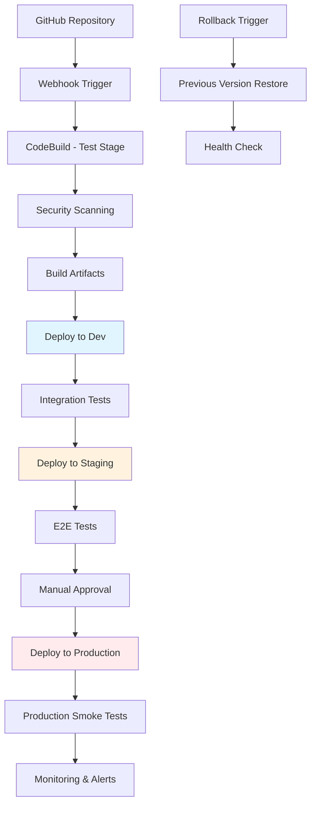

# EconLens AWS Deployment and Operations

## Executive Summary

This document outlines the complete production deployment and operational excellence framework for EconLens. It covers Infrastructure as Code using AWS CDK, automated CI/CD pipelines, comprehensive monitoring and alerting, cost optimization strategies, and security operations. The approach ensures reliable, scalable, and maintainable production operations while demonstrating advanced AWS DevOps capabilities.

## Infrastructure as Code with AWS CDK

### CDK Project Structure and Organization

#### Project Directory Structure
```
infrastructure/
├── bin/
│   └── econlens.ts              # CDK app entry point
├── lib/
│   ├── stacks/
│   │   ├── network-stack.ts     # VPC, subnets, security groups
│   │   ├── storage-stack.ts     # RDS, S3, ElastiCache
│   │   ├── compute-stack.ts     # Lambda functions, API Gateway
│   │   ├── auth-stack.ts        # Cognito User/Identity Pools
│   │   ├── frontend-stack.ts    # S3, CloudFront, Route 53
│   │   ├── monitoring-stack.ts  # CloudWatch, SNS, dashboards
│   │   ├── security-stack.ts    # WAF, Config, GuardDuty
│   │   └── pipeline-stack.ts    # CI/CD pipeline resources
│   ├── constructs/
│   │   ├── lambda-function.ts   # Reusable Lambda construct
│   │   ├── api-resource.ts      # API Gateway resource construct
│   │   ├── monitoring.ts        # Monitoring construct
│   │   └── security.ts          # Security construct
│   └── config/
│       ├── dev.ts               # Development environment config
│       ├── staging.ts           # Staging environment config
│       └── prod.ts              # Production environment config
├── scripts/
│   ├── deploy.sh                # Deployment scripts
│   ├── rollback.sh              # Rollback procedures
│   └── cleanup.sh               # Resource cleanup
├── tests/
│   ├── unit/                    # Unit tests for constructs
│   ├── integration/             # Integration tests
│   └── snapshots/               # CDK snapshot tests
├── cdk.json                     # CDK configuration
├── package.json                 # Dependencies and scripts
└── README.md                    # Infrastructure documentation
```

#### Environment Configuration Management
```typescript
// lib/config/base.ts
export interface EnvironmentConfig {
    environment: string;
    region: string;
    account: string;
    
    // Application settings
    domainName: string;
    certificateArn: string;
    
    // Database settings
    rdsInstanceType: string;
    rdsMultiAz: boolean;
    rdsBackupRetention: number;
    
    // Lambda settings
    lambdaTimeout: number;
    lambdaMemory: number;
    lambdaReservedConcurrency?: number;
    
    // Cache settings
    elastiCacheNodeType: string;
    elastiCacheNumNodes: number;
    
    // Monitoring settings
    logRetentionDays: number;
    enableXRayTracing: boolean;
    
    // Cost settings
    monthlyBudgetLimit: number;
    billingAlerts: number[];
}

// lib/config/prod.ts
export const prodConfig: EnvironmentConfig = {
    environment: 'prod',
    region: 'us-east-1',
    account: process.env.PROD_ACCOUNT_ID!,
    
    domainName: 'econlens.com',
    certificateArn: process.env.PROD_CERTIFICATE_ARN!,
    
    rdsInstanceType: 'db.t3.small',
    rdsMultiAz: true,
    rdsBackupRetention: 30,
    
    lambdaTimeout: 30,
    lambdaMemory: 1024,
    lambdaReservedConcurrency: 100,
    
    elastiCacheNodeType: 'cache.t3.micro',
    elastiCacheNumNodes: 2,
    
    logRetentionDays: 90,
    enableXRayTracing: true,
    
    monthlyBudgetLimit: 500,
    billingAlerts: [100, 250, 400]
};
```

### Core Infrastructure Stacks

#### Network Stack Implementation
```typescript
// lib/stacks/network-stack.ts
import * as cdk from 'aws-cdk-lib';
import * as ec2 from 'aws-cdk-lib/aws-ec2';
import { Construct } from 'constructs';
import { EnvironmentConfig } from '../config/base';

export class NetworkStack extends cdk.Stack {
    public readonly vpc: ec2.Vpc;
    public readonly lambdaSecurityGroup: ec2.SecurityGroup;
    public readonly rdsSecurityGroup: ec2.SecurityGroup;
    public readonly cacheSecurityGroup: ec2.SecurityGroup;

    constructor(scope: Construct, id: string, config: EnvironmentConfig, props?: cdk.StackProps) {
        super(scope, id, props);

        // VPC with public and private subnets across 2 AZs
        this.vpc = new ec2.Vpc(this, 'EconLensVPC', {
            cidr: '10.0.0.0/16',
            maxAzs: 2,
            subnetConfiguration: [
                {
                    cidrMask: 24,
                    name: 'public',
                    subnetType: ec2.SubnetType.PUBLIC,
                },
                {
                    cidrMask: 24,
                    name: 'private-app',
                    subnetType: ec2.SubnetType.PRIVATE_WITH_EGRESS,
                },
                {
                    cidrMask: 24,
                    name: 'private-data',
                    subnetType: ec2.SubnetType.PRIVATE_ISOLATED,
                }
            ],
            natGateways: config.environment === 'prod' ? 2 : 1,
            enableDnsHostnames: true,
            enableDnsSupport: true,
        });

        // Security Groups
        this.lambdaSecurityGroup = new ec2.SecurityGroup(this, 'LambdaSecurityGroup', {
            vpc: this.vpc,
            description: 'Security group for Lambda functions',
            allowAllOutbound: true,
        });

        this.rdsSecurityGroup = new ec2.SecurityGroup(this, 'RDSSecurityGroup', {
            vpc: this.vpc,
            description: 'Security group for RDS database',
            allowAllOutbound: false,
        });

        this.cacheSecurityGroup = new ec2.SecurityGroup(this, 'CacheSecurityGroup', {
            vpc: this.vpc,
            description: 'Security group for ElastiCache',
            allowAllOutbound: false,
        });

        // Security group rules
        this.rdsSecurityGroup.addIngressRule(
            this.lambdaSecurityGroup,
            ec2.Port.tcp(5432),
            'Allow Lambda functions to access RDS'
        );

        this.cacheSecurityGroup.addIngressRule(
            this.lambdaSecurityGroup,
            ec2.Port.tcp(6379),
            'Allow Lambda functions to access Redis'
        );

        // VPC Endpoints for AWS services
        this.vpc.addGatewayEndpoint('S3Endpoint', {
            service: ec2.GatewayVpcEndpointAwsService.S3,
        });

        new ec2.InterfaceVpcEndpoint(this, 'BedrockEndpoint', {
            vpc: this.vpc,
            service: ec2.InterfaceVpcEndpointAwsService.BEDROCK_RUNTIME,
            subnets: { subnetType: ec2.SubnetType.PRIVATE_WITH_EGRESS },
        });

        // Outputs
        new cdk.CfnOutput(this, 'VpcId', {
            value: this.vpc.vpcId,
            description: 'VPC ID',
            exportName: `${config.environment}-vpc-id`,
        });
    }
}
```

#### Storage Stack Implementation
```typescript
// lib/stacks/storage-stack.ts
import * as cdk from 'aws-cdk-lib';
import * as rds from 'aws-cdk-lib/aws-rds';
import * as s3 from 'aws-cdk-lib/aws-s3';
import * as elasticache from 'aws-cdk-lib/aws-elasticache';
import * as ec2 from 'aws-cdk-lib/aws-ec2';
import { Construct } from 'constructs';

export class StorageStack extends cdk.Stack {
    public readonly database: rds.DatabaseInstance;
    public readonly portfolioFilesBucket: s3.Bucket;
    public readonly cache: elasticache.CfnCacheCluster;

    constructor(scope: Construct, id: string, vpc: ec2.Vpc, securityGroups: any, config: EnvironmentConfig, props?: cdk.StackProps) {
        super(scope, id, props);

        // RDS PostgreSQL Database
        this.database = new rds.DatabaseInstance(this, 'EconLensDB', {
            engine: rds.DatabaseInstanceEngine.postgres({
                version: rds.PostgresEngineVersion.VER_14,
            }),
            instanceType: ec2.InstanceType.of(ec2.InstanceClass.T3, ec2.InstanceSize.MICRO),
            credentials: rds.Credentials.fromGeneratedSecret('econlens_admin', {
                secretName: `${config.environment}/econlens/db-credentials`,
                excludeCharacters: '"@/\\',
            }),
            vpc,
            vpcSubnets: { subnetType: ec2.SubnetType.PRIVATE_ISOLATED },
            securityGroups: [securityGroups.rdsSecurityGroup],
            multiAz: config.rdsMultiAz,
            backupRetention: cdk.Duration.days(config.rdsBackupRetention),
            deletionProtection: config.environment === 'prod',
            storageEncrypted: true,
            monitoringInterval: cdk.Duration.seconds(60),
            enablePerformanceInsights: true,
            performanceInsightRetention: rds.PerformanceInsightRetention.DEFAULT,
            databaseName: 'econlens',
            parameterGroup: new rds.ParameterGroup(this, 'DBParameterGroup', {
                engine: rds.DatabaseInstanceEngine.postgres({
                    version: rds.PostgresEngineVersion.VER_14,
                }),
                parameters: {
                    'shared_preload_libraries': 'pg_stat_statements',
                    'log_statement': 'all',
                    'log_min_duration_statement': '1000',
                },
            }),
        });

        // S3 Bucket for portfolio file uploads
        this.portfolioFilesBucket = new s3.Bucket(this, 'PortfolioFilesBucket', {
            bucketName: `${config.environment}-econlens-portfolio-files`,
            encryption: s3.BucketEncryption.S3_MANAGED,
            blockPublicAccess: s3.BlockPublicAccess.BLOCK_ALL,
            versioned: true,
            lifecycleRules: [
                {
                    id: 'DeleteOldVersions',
                    abortIncompleteMultipartUploadAfter: cdk.Duration.days(7),
                    noncurrentVersionExpiration: cdk.Duration.days(30),
                },
                {
                    id: 'DeleteOldUploads',
                    expiration: cdk.Duration.days(90),
                    transitions: [
                        {
                            storageClass: s3.StorageClass.INFREQUENT_ACCESS,
                            transitionAfter: cdk.Duration.days(30),
                        },
                        {
                            storageClass: s3.StorageClass.GLACIER,
                            transitionAfter: cdk.Duration.days(60),
                        },
                    ],
                },
            ],
        });

        // ElastiCache Redis Cluster
        const cacheSubnetGroup = new elasticache.CfnSubnetGroup(this, 'CacheSubnetGroup', {
            description: 'Subnet group for ElastiCache',
            subnetIds: vpc.selectSubnets({ subnetType: ec2.SubnetType.PRIVATE_WITH_EGRESS }).subnetIds,
        });

        this.cache = new elasticache.CfnCacheCluster(this, 'EconLensCache', {
            cacheNodeType: config.elastiCacheNodeType,
            engine: 'redis',
            numCacheNodes: config.elastiCacheNumNodes,
            vpcSecurityGroupIds: [securityGroups.cacheSecurityGroup.securityGroupId],
            cacheSubnetGroupName: cacheSubnetGroup.ref,
            engineVersion: '7.0',
            preferredMaintenanceWindow: 'sun:03:00-sun:05:00',
            snapshotRetentionLimit: config.environment === 'prod' ? 7 : 1,
            snapshotWindow: '02:00-03:00',
        });

        // Outputs
        new cdk.CfnOutput(this, 'DatabaseEndpoint', {
            value: this.database.instanceEndpoint.hostname,
            description: 'RDS Database Endpoint',
            exportName: `${config.environment}-db-endpoint`,
        });

        new cdk.CfnOutput(this, 'CacheEndpoint', {
            value: this.cache.attrRedisEndpointAddress,
            description: 'Redis Cache Endpoint',
            exportName: `${config.environment}-cache-endpoint`,
        });
    }
}
```

### Lambda Function Constructs
```typescript
// lib/constructs/lambda-function.ts
import * as cdk from 'aws-cdk-lib';
import * as lambda from 'aws-cdk-lib/aws-lambda';
import * as iam from 'aws-cdk-lib/aws-iam';
import * as ec2 from 'aws-cdk-lib/aws-ec2';
import { Construct } from 'constructs';

export interface EconLensLambdaProps {
    functionName: string;
    description: string;
    codePath: string;
    handler: string;
    timeout: cdk.Duration;
    memorySize: number;
    environment: { [key: string]: string };
    vpc?: ec2.Vpc;
    securityGroups?: ec2.SecurityGroup[];
    reservedConcurrency?: number;
    enableXRay?: boolean;
    deadLetterQueue?: any;
}

export class EconLensLambdaFunction extends Construct {
    public readonly function: lambda.Function;

    constructor(scope: Construct, id: string, props: EconLensLambdaProps) {
        super(scope, id);

        this.function = new lambda.Function(this, 'Function', {
            runtime: lambda.Runtime.NODEJS_18_X,
            code: lambda.Code.fromAsset(props.codePath),
            handler: props.handler,
            functionName: props.functionName,
            description: props.description,
            timeout: props.timeout,
            memorySize: props.memorySize,
            environment: {
                NODE_ENV: 'production',
                ...props.environment,
            },
            vpc: props.vpc,
            vpcSubnets: props.vpc ? { subnetType: ec2.SubnetType.PRIVATE_WITH_EGRESS } : undefined,
            securityGroups: props.securityGroups,
            reservedConcurrency: props.reservedConcurrency,
            tracing: props.enableXRay ? lambda.Tracing.ACTIVE : lambda.Tracing.DISABLED,
            deadLetterQueue: props.deadLetterQueue,
            logRetention: 90,
        });

        // Basic execution role permissions
        this.function.addToRolePolicy(
            new iam.PolicyStatement({
                actions: [
                    'logs:CreateLogGroup',
                    'logs:CreateLogStream',
                    'logs:PutLogEvents',
                ],
                resources: ['*'],
            })
        );

        if (props.enableXRay) {
            this.function.addToRolePolicy(
                new iam.PolicyStatement({
                    actions: [
                        'xray:PutTraceSegments',
                        'xray:PutTelemetryRecords',
                    ],
                    resources: ['*'],
                })
            );
        }
    }

    public addBedrockPermissions() {
        this.function.addToRolePolicy(
            new iam.PolicyStatement({
                actions: [
                    'bedrock:InvokeModel',
                    'bedrock:ListFoundationModels',
                ],
                resources: ['*'],
            })
        );
    }

    public addS3Permissions(bucketArn: string) {
        this.function.addToRolePolicy(
            new iam.PolicyStatement({
                actions: [
                    's3:GetObject',
                    's3:PutObject',
                    's3:DeleteObject',
                    's3:GetObjectVersion',
                ],
                resources: [`${bucketArn}/*`],
            })
        );
    }

    public addSecretsManagerPermissions(secretArn: string) {
        this.function.addToRolePolicy(
            new iam.PolicyStatement({
                actions: [
                    'secretsmanager:GetSecretValue',
                ],
                resources: [secretArn],
            })
        );
    }
}
```

## CI/CD Pipeline Design

### Pipeline Architecture Overview


### GitHub Actions Workflow
```yaml
# .github/workflows/deploy.yml
name: EconLens CI/CD Pipeline

on:
  push:
    branches: [main, develop]
  pull_request:
    branches: [main]

env:
  AWS_REGION: us-east-1
  NODE_VERSION: '18'

jobs:
  test:
    runs-on: ubuntu-latest
    steps:
      - uses: actions/checkout@v3
      
      - name: Setup Node.js
        uses: actions/setup-node@v3
        with:
          node-version: ${{ env.NODE_VERSION }}
          cache: 'npm'
          
      - name: Install dependencies
        run: |
          npm ci
          cd infrastructure && npm ci
          
      - name: Run unit tests
        run: npm test -- --coverage --watchAll=false
        
      - name: Run integration tests
        run: npm run test:integration
        
      - name: Run CDK tests
        run: cd infrastructure && npm test
        
      - name: Upload coverage to Codecov
        uses: codecov/codecov-action@v3

  security:
    runs-on: ubuntu-latest
    needs: test
    steps:
      - uses: actions/checkout@v3
      
      - name: Run SAST with CodeQL
        uses: github/codeql-action/analyze@v2
        with:
          languages: javascript,typescript
          
      - name: Run dependency check
        run: npm audit --audit-level=high
        
      - name: Run CDK security check
        run: |
          cd infrastructure
          npm install -g cdk-nag
          npx cdk-nag

  build:
    runs-on: ubuntu-latest
    needs: [test, security]
    if: github.ref == 'refs/heads/main' || github.ref == 'refs/heads/develop'
    steps:
      - uses: actions/checkout@v3
      
      - name: Setup Node.js
        uses: actions/setup-node@v3
        with:
          node-version: ${{ env.NODE_VERSION }}
          cache: 'npm'
          
      - name: Configure AWS credentials
        uses: aws-actions/configure-aws-credentials@v2
        with:
          aws-access-key-id: ${{ secrets.AWS_ACCESS_KEY_ID }}
          aws-secret-access-key: ${{ secrets.AWS_SECRET_ACCESS_KEY }}
          aws-region: ${{ env.AWS_REGION }}
          
      - name: Build frontend
        run: |
          npm ci
          npm run build
          
      - name: Build Lambda functions
        run: |
          cd backend
          npm ci
          npm run build
          
      - name: Upload artifacts
        uses: actions/upload-artifact@v3
        with:
          name: build-artifacts
          path: |
            build/
            backend/dist/

  deploy-dev:
    runs-on: ubuntu-latest
    needs: build
    if: github.ref == 'refs/heads/develop'
    environment: development
    steps:
      - uses: actions/checkout@v3
      
      - name: Configure AWS credentials
        uses: aws-actions/configure-aws-credentials@v2
        with:
          aws-access-key-id: ${{ secrets.DEV_AWS_ACCESS_KEY_ID }}
          aws-secret-access-key: ${{ secrets.DEV_AWS_SECRET_ACCESS_KEY }}
          aws-region: ${{ env.AWS_REGION }}
          
      - name: Download artifacts
        uses: actions/download-artifact@v3
        with:
          name: build-artifacts
          
      - name: Deploy infrastructure
        run: |
          cd infrastructure
          npm ci
          npx cdk deploy --all --require-approval never --context env=dev
          
      - name: Run post-deployment tests
        run: npm run test:e2e:dev

  deploy-staging:
    runs-on: ubuntu-latest
    needs: build
    if: github.ref == 'refs/heads/main'
    environment: staging
    steps:
      - uses: actions/checkout@v3
      
      - name: Configure AWS credentials
        uses: aws-actions/configure-aws-credentials@v2
        with:
          aws-access-key-id: ${{ secrets.STAGING_AWS_ACCESS_KEY_ID }}
          aws-secret-access-key: ${{ secrets.STAGING_AWS_SECRET_ACCESS_KEY }}
          aws-region: ${{ env.AWS_REGION }}
          
      - name: Deploy infrastructure
        run: |
          cd infrastructure
          npm ci
          npx cdk deploy --all --require-approval never --context env=staging
          
      - name: Run E2E tests
        run: npm run test:e2e:staging

  deploy-production:
    runs-on: ubuntu-latest
    needs: deploy-staging
    if: github.ref == 'refs/heads/main'
    environment: production
    steps:
      - uses: actions/checkout@v3
      
      - name: Configure AWS credentials
        uses: aws-actions/configure-aws-credentials@v2
        with:
          aws-access-key-id: ${{ secrets.PROD_AWS_ACCESS_KEY_ID }}
          aws-secret-access-key: ${{ secrets.PROD_AWS_SECRET_ACCESS_KEY }}
          aws-region: ${{ env.AWS_REGION }}
          
      - name: Deploy infrastructure
        run: |
          cd infrastructure
          npm ci
          npx cdk deploy --all --require-approval never --context env=prod
          
      - name: Run production smoke tests
        run: npm run test:smoke:prod
        
      - name: Update deployment status
        run: |
          curl -X POST ${{ secrets.SLACK_WEBHOOK }} \
          -H 'Content-type: application/json' \
          --data '{"text":"🚀 EconLens production deployment completed successfully!"}'
```

### CodePipeline Implementation
```typescript
// lib/stacks/pipeline-stack.ts
import * as cdk from 'aws-cdk-lib';
import * as codepipeline from 'aws-cdk-lib/aws-codepipeline';
import * as codepipeline_actions from 'aws-cdk-lib/aws-codepipeline-actions';
import * as codebuild from 'aws-cdk-lib/aws-codebuild';
import * as s3 from 'aws-cdk-lib/aws-s3';
import { Construct } from 'constructs';

export class PipelineStack extends cdk.Stack {
    constructor(scope: Construct, id: string, props?: cdk.StackProps) {
        super(scope, id, props);

        // Artifact bucket
        const artifactsBucket = new s3.Bucket(this, 'PipelineArtifacts', {
            encryption: s3.BucketEncryption.S3_MANAGED,
            blockPublicAccess: s3.BlockPublicAccess.BLOCK_ALL,
        });

        // Source action
        const sourceOutput = new codepipeline.Artifact();
        const sourceAction = new codepipeline_actions.GitHubSourceAction({
            actionName: 'GitHub_Source',
            owner: process.env.GITHUB_OWNER!,
            repo: 'econlens',
            branch: 'main',
            oauthToken: cdk.SecretValue.secretsManager('github-token'),
            output: sourceOutput,
        });

        // Build project
        const buildProject = new codebuild.PipelineProject(this, 'BuildProject', {
            buildSpec: codebuild.BuildSpec.fromObject({
                version: '0.2',
                phases: {
                    pre_build: {
                        commands: [
                            'echo Logging in to Amazon ECR...',
                            'aws --version',
                            'npm install',
                        ],
                    },
                    build: {
                        commands: [
                            'echo Build started on `date`',
                            'npm run test',
                            'npm run build',
                            'cd infrastructure && npm ci && npm run build && npm run test',
                        ],
                    },
                    post_build: {
                        commands: [
                            'echo Build completed on `date`',
                        ],
                    },
                },
                artifacts: {
                    files: [
                        '**/*',
                    ],
                },
            }),
            environment: {
                buildImage: codebuild.LinuxBuildImage.STANDARD_5_0,
                computeType: codebuild.ComputeType.SMALL,
            },
        });

        // Build action
        const buildOutput = new codepipeline.Artifact();
        const buildAction = new codepipeline_actions.CodeBuildAction({
            actionName: 'Build',
            project: buildProject,
            input: sourceOutput,
            outputs: [buildOutput],
        });

        // Deploy actions for each environment
        const deployDevAction = new codepipeline_actions.CloudFormationCreateUpdateStackAction({
            actionName: 'Deploy_Dev',
            templatePath: buildOutput.atPath('infrastructure/cdk.out/EconLensStack-dev.template.json'),
            stackName: 'EconLensStack-dev',
            adminPermissions: true,
            runOrder: 1,
        });

        // Pipeline
        new codepipeline.Pipeline(this, 'EconLensPipeline', {
            pipelineName: 'EconLens-Pipeline',
            artifactBucket: artifactsBucket,
            stages: [
                {
                    stageName: 'Source',
                    actions: [sourceAction],
                },
                {
                    stageName: 'Build',
                    actions: [buildAction],
                },
                {
                    stageName: 'Deploy-Dev',
                    actions: [deployDevAction],
                },
                // Additional stages for staging and production...
            ],
        });
    }
}
```

## Monitoring and Alerting Framework

### CloudWatch Dashboard Configuration
```typescript
// lib/stacks/monitoring-stack.ts
import * as cdk from 'aws-cdk-lib';
import * as cloudwatch from 'aws-cdk-lib/aws-cloudwatch';
import * as sns from 'aws-cdk-lib/aws-sns';
import * as subscriptions from 'aws-cdk-lib/aws-sns-subscriptions';
import * as lambda from 'aws-cdk-lib/aws-lambda';
import { Construct } from 'constructs';

export class MonitoringStack extends cdk.Stack {
    public readonly alertTopic: sns.Topic;
    public readonly dashboard: cloudwatch.Dashboard;

    constructor(scope: Construct, id: string, lambdaFunctions: lambda.Function[], config: EnvironmentConfig, props?: cdk.StackProps) {
        super(scope, id, props);

        // SNS Topic for alerts
        this.alertTopic = new sns.Topic(this, 'AlertTopic', {
            topicName: `${config.environment}-econlens-alerts`,
            displayName: 'EconLens Monitoring Alerts',
        });

        // Email subscription for alerts
        this.alertTopic.addSubscription(
            new subscriptions.EmailSubscription(process.env.ALERT_EMAIL!)
        );

        // CloudWatch Dashboard
        this.dashboard = new cloudwatch.Dashboard(this, 'EconLensDashboard', {
            dashboardName: `${config.environment}-EconLens-Operations`,
        });

        // Application Performance Metrics
        const apiGatewayWidget = new cloudwatch.GraphWidget({
            title: 'API Gateway Performance',
            width: 12,
            height: 6,
            left: [
                new cloudwatch.Metric({
                    namespace: 'AWS/ApiGateway',
                    metricName: 'Count',
                    dimensionsMap: { ApiName: 'econlens-api' },
                    statistic: 'Sum',
                    period: cdk.Duration.minutes(5),
                }),
                new cloudwatch.Metric({
                    namespace: 'AWS/ApiGateway',
                    metricName: 'Latency',
                    dimensionsMap: { ApiName: 'econlens-api' },
                    statistic: 'Average',
                    period: cdk.Duration.minutes(5),
                }),
            ],
            right: [
                new cloudwatch.Metric({
                    namespace: 'AWS/ApiGateway',
                    metricName: '4XXError',
                    dimensionsMap: { ApiName: 'econlens-api' },
                    statistic: 'Sum',
                    period: cdk.Duration.minutes(5),
                }),
                new cloudwatch.Metric({
                    namespace: 'AWS/ApiGateway',
                    metricName: '5XXError',
                    dimensionsMap: { ApiName: 'econlens-api' },
                    statistic: 'Sum',
                    period: cdk.Duration.minutes(5),
                }),
            ],
        });

        // Lambda Performance Metrics
        const lambdaWidget = new cloudwatch.GraphWidget({
            title: 'Lambda Function Performance',
            width: 12,
            height: 6,
            left: lambdaFunctions.map(fn => 
                new cloudwatch.Metric({
                    namespace: 'AWS/Lambda',
                    metricName: 'Duration',
                    dimensionsMap: { FunctionName: fn.functionName },
                    statistic: 'Average',
                    period: cdk.Duration.minutes(5),
                })
            ),
            right: lambdaFunctions.map(fn =>
                new cloudwatch.Metric({
                    namespace: 'AWS/Lambda',
                    metricName: 'Errors',
                    dimensionsMap: { FunctionName: fn.functionName },
                    statistic: 'Sum',
                    period: cdk.Duration.minutes(5),
                })
            ),
        });

        // Database Performance
        const rdsWidget = new cloudwatch.GraphWidget({
            title: 'RDS Performance',
            width: 12,
            height: 6,
            left: [
                new cloudwatch.Metric({
                    namespace: 'AWS/RDS',
                    metricName: 'CPUUtilization',
                    dimensionsMap: { DBInstanceIdentifier: `${config.environment}-econlens-db` },
                    statistic: 'Average',
                }),
                new cloudwatch.Metric({
                    namespace: 'AWS/RDS',
                    metricName: 'DatabaseConnections',
                    dimensionsMap: { DBInstanceIdentifier: `${config.environment}-econlens-db` },
                    statistic: 'Average',
                }),
            ],
            right: [
                new cloudwatch.Metric({
                    namespace: 'AWS/RDS',
                    metricName: 'ReadLatency',
                    dimensionsMap: { DBInstanceIdentifier: `${config.environment}-econlens-db` },
                    statistic: 'Average',
                }),
                new cloudwatch.Metric({
                    namespace: 'AWS/RDS',
                    metricName: 'WriteLatency',
                    dimensionsMap: { DBInstanceIdentifier: `${config.environment}-econlens-db` },
                    statistic: 'Average',
                }),
            ],
        });

        // Business Metrics
        const businessWidget = new cloudwatch.GraphWidget({
            title: 'Business Metrics',
            width: 12,
            height: 6,
            left: [
                new cloudwatch.Metric({
                    namespace: 'EconLens/Business',
                    metricName: 'UserRegistrations',
                    statistic: 'Sum',
                    period: cdk.Duration.hours(1),
                }),
                new cloudwatch.Metric({
                    namespace: 'EconLens/Business',
                    metricName: 'PortfoliosCreated',
                    statistic: 'Sum',
                    period: cdk.Duration.hours(1),
                }),
            ],
            right: [
                new cloudwatch.Metric({
                    namespace: 'EconLens/Business',
                    metricName: 'ScenarioAnalyses',
                    statistic: 'Sum',
                    period: cdk.Duration.hours(1),
                }),
                new cloudwatch.Metric({
                    namespace: 'EconLens/Business',
                    metricName: 'AIInsightsGenerated',
                    statistic: 'Sum',
                    period: cdk.Duration.hours(1),
                }),
            ],
        });

        // Add widgets to dashboard
        this.dashboard.addWidgets(apiGatewayWidget, lambdaWidget, rdsWidget, businessWidget);

        // Critical Alarms
        this.createAlarms(lambdaFunctions, config);
    }

    private createAlarms(lambdaFunctions: lambda.Function[], config: EnvironmentConfig) {
        // API Gateway 5XX Errors
        const apiErrorAlarm = new cloudwatch.Alarm(this, 'APIGateway5XXAlarm', {
            metric: new cloudwatch.Metric({
                namespace: 'AWS/ApiGateway',
                metricName: '5XXError',
                dimensionsMap: { ApiName: 'econlens-api' },
                statistic: 'Sum',
                period: cdk.Duration.minutes(5),
            }),
            threshold: 5,
            evaluationPeriods: 2,
            treatMissingData: cloudwatch.TreatMissingData.NOT_BREACHING,
        });
        apiErrorAlarm.addAlarmAction(new cloudwatch_actions.SnsAction(this.alertTopic));

        // Lambda Error Rate
        lambdaFunctions.forEach((fn, index) => {
            const errorAlarm = new cloudwatch.Alarm(this, `LambdaErrorAlarm${index}`, {
                metric: new cloudwatch.Metric({
                    namespace: 'AWS/Lambda',
                    metricName: 'Errors',
                    dimensionsMap: { FunctionName: fn.functionName },
                    statistic: 'Sum',
                    period: cdk.Duration.minutes(5),
                }),
                threshold: 3,
                evaluationPeriods: 2,
            });
            errorAlarm.addAlarmAction(new cloudwatch_actions.SnsAction(this.alertTopic));
        });

        // RDS CPU Utilization
        const rdsAlarm = new cloudwatch.Alarm(this, 'RDSCPUAlarm', {
            metric: new cloudwatch.Metric({
                namespace: 'AWS/RDS',
                metricName: 'CPUUtilization',
                dimensionsMap: { DBInstanceIdentifier: `${config.environment}-econlens-db` },
                statistic: 'Average',
                period: cdk.Duration.minutes(5),
            }),
            threshold: 80,
            evaluationPeriods: 3,
        });
        rdsAlarm.addAlarmAction(new cloudwatch_actions.SnsAction(this.alertTopic));
    }
}
```

### Custom Metrics and Logging
```javascript
// utils/metrics.js - Custom business metrics
const AWS = require('aws-sdk');
const cloudwatch = new AWS.CloudWatch();

class MetricsLogger {
    constructor() {
        this.namespace = 'EconLens/Business';
    }

    async publishMetric(metricName, value, unit = 'Count', dimensions = []) {
        const params = {
            Namespace: this.namespace,
            MetricData: [
                {
                    MetricName: metricName,
                    Value: value,
                    Unit: unit,
                    Dimensions: dimensions,
                    Timestamp: new Date()
                }
            ]
        };

        try {
            await cloudwatch.putMetricData(params).promise();
        } catch (error) {
            console.error('Failed to publish metric:', error);
        }
    }

    async recordUserRegistration(userType) {
        await this.publishMetric('UserRegistrations', 1, 'Count', [
            { Name: 'UserType', Value: userType }
        ]);
    }

    async recordPortfolioCreation(portfolioValue) {
        await this.publishMetric('PortfoliosCreated', 1);
        await this.publishMetric('PortfolioValueCreated', portfolioValue, 'None');
    }

    async recordScenarioAnalysis(scenarioType, processingTimeMs) {
        await this.publishMetric('ScenarioAnalyses', 1, 'Count', [
            { Name: 'ScenarioType', Value: scenarioType }
        ]);
        await this.publishMetric('ScenarioProcessingTime', processingTimeMs, 'Milliseconds');
    }

    async recordAIInsightGeneration(insightQuality, cost) {
        await this.publishMetric('AIInsightsGenerated', 1);
        await this.publishMetric('AIInsightCost', cost, 'None');
        await this.publishMetric('AIInsightQuality', insightQuality, 'None');
    }
}

module.exports = new MetricsLogger();
```

## Cost Management and Optimization

### Cost Monitoring Implementation
```typescript
// lib/stacks/cost-monitoring-stack.ts
import * as cdk from 'aws-cdk-lib';
import * as budgets from 'aws-cdk-lib/aws-budgets';
import * as sns from 'aws-cdk-lib/aws-sns';
import { Construct } from 'constructs';

export class CostMonitoringStack extends cdk.Stack {
    constructor(scope: Construct, id: string, alertTopic: sns.Topic, config: EnvironmentConfig, props?: cdk.StackProps) {
        super(scope, id, props);

        // Monthly budget with alerts
        new budgets.CfnBudget(this, 'MonthlyBudget', {
            budget: {
                budgetName: `${config.environment}-EconLens-Monthly-Budget`,
                budgetLimit: {
                    amount: config.monthlyBudgetLimit,
                    unit: 'USD',
                },
                timeUnit: 'MONTHLY',
                budgetType: 'COST',
                costFilters: {
                    TagKey: ['Project'],
                    TagValue: ['EconLens'],
                },
            },
            notificationsWithSubscribers: config.billingAlerts.map((threshold, index) => ({
                notification: {
                    notificationType: 'ACTUAL',
                    comparisonOperator: 'GREATER_THAN',
                    threshold: threshold / config.monthlyBudgetLimit * 100,
                    thresholdType: 'PERCENTAGE',
                },
                subscribers: [
                    {
                        subscriptionType: 'EMAIL',
                        address: process.env.BILLING_ALERT_EMAIL!,
                    },
                ],
            })),
        });

        // Service-specific budgets
        const lambdaBudget = new budgets.CfnBudget(this, 'LambdaBudget', {
            budget: {
                budgetName: `${config.environment}-Lambda-Budget`,
                budgetLimit: {
                    amount: config.monthlyBudgetLimit * 0.3, // 30% for Lambda
                    unit: 'USD',
                },
                timeUnit: 'MONTHLY',
                budgetType: 'COST',
                costFilters: {
                    Service: ['Amazon Lambda', 'AWS Lambda'],
                },
            },
        });

        // RDS Budget
        const rdsBudget = new budgets.CfnBudget(this, 'RDSBudget', {
            budget: {
                budgetName: `${config.environment}-RDS-Budget`,
                budgetLimit: {
                    amount: config.monthlyBudgetLimit * 0.4, // 40% for RDS
                    unit: 'USD',
                },
                timeUnit: 'MONTHLY',
                budgetType: 'COST',
                costFilters: {
                    Service: ['Amazon Relational Database Service'],
                },
            },
        });
    }
}
```

### Cost Optimization Strategies
```javascript
// scripts/cost-optimization.js
const AWS = require('aws-sdk');
const costExplorer = new AWS.CostExplorer({ region: 'us-east-1' });
const lambda = new AWS.Lambda();
const rds = new AWS.RDS();

class CostOptimizer {
    async analyzeCosts() {
        const endDate = new Date().toISOString().split('T')[0];
        const startDate = new Date(Date.now() - 30 * 24 * 60 * 60 * 1000).toISOString().split('T')[0];

        const params = {
            TimePeriod: {
                Start: startDate,
                End: endDate
            },
            Granularity: 'MONTHLY',
            Metrics: ['BlendedCost'],
            GroupBy: [
                {
                    Type: 'DIMENSION',
                    Key: 'SERVICE'
                }
            ]
        };

        try {
            const result = await costExplorer.getCostAndUsage(params).promise();
            return this.processCostData(result);
        } catch (error) {
            console.error('Cost analysis failed:', error);
            return null;
        }
    }

    processsCostData(costData) {
        const recommendations = [];
        
        costData.ResultsByTime[0].Groups.forEach(group => {
            const service = group.Keys[0];
            const cost = parseFloat(group.Metrics.BlendedCost.Amount);
            
            if (service === 'Amazon Lambda' && cost > 50) {
                recommendations.push({
                    service: 'Lambda',
                    recommendation: 'Consider implementing provisioned concurrency optimization',
                    potentialSavings: cost * 0.2
                });
            }
            
            if (service === 'Amazon Relational Database Service' && cost > 100) {
                recommendations.push({
                    service: 'RDS',
                    recommendation: 'Evaluate instance rightsizing opportunities',
                    potentialSavings: cost * 0.15
                });
            }
        });
        
        return recommendations;
    }

    async optimizeLambdaColdStarts() {
        // Analyze Lambda cold start metrics and adjust provisioned concurrency
        const functions = await lambda.listFunctions().promise();
        
        for (const func of functions.Functions) {
            const metrics = await this.getLambdaMetrics(func.FunctionName);
            
            if (metrics.avgColdStartTime > 3000 && metrics.invocationsPerHour > 10) {
                console.log(`Recommending provisioned concurrency for ${func.FunctionName}`);
                // Implementation would adjust provisioned concurrency settings
            }
        }
    }

    async rightSizeRDSInstances() {
        // Analyze RDS utilization and recommend instance size adjustments
        const instances = await rds.describeDBInstances().promise();
        
        for (const instance of instances.DBInstances) {
            const utilization = await this.getRDSUtilization(instance.DBInstanceIdentifier);
            
            if (utilization.avgCPU < 20 && utilization.avgConnections < 10) {
                console.log(`Recommending downsize for ${instance.DBInstanceIdentifier}`);
            }
        }
    }

    async getLambdaMetrics(functionName) {
        // CloudWatch metrics retrieval logic
        return {
            avgColdStartTime: 2500,
            invocationsPerHour: 25
        };
    }

    async getRDSUtilization(instanceId) {
        // CloudWatch metrics retrieval logic  
        return {
            avgCPU: 15,
            avgConnections: 5
        };
    }
}

module.exports = new CostOptimizer();
```

## Security Operations

### Security Hardening Stack
```typescript
// lib/stacks/security-stack.ts
import * as cdk from 'aws-cdk-lib';
import * as wafv2 from 'aws-cdk-lib/aws-wafv2';
import * as config from 'aws-cdk-lib/aws-config';
import * as guardduty from 'aws-cdk-lib/aws-guardduty';
import * as cloudtrail from 'aws-cdk-lib/aws-cloudtrail';
import * as s3 from 'aws-cdk-lib/aws-s3';
import { Construct } from 'constructs';

export class SecurityStack extends cdk.Stack {
    public readonly webAcl: wafv2.CfnWebACL;

    constructor(scope: Construct, id: string, config: EnvironmentConfig, props?: cdk.StackProps) {
        super(scope, id, props);

        // WAF Web ACL
        this.webAcl = new wafv2.CfnWebACL(this, 'EconLensWAF', {
            scope: 'CLOUDFRONT',
            defaultAction: { allow: {} },
            rules: [
                {
                    name: 'RateLimitRule',
                    priority: 1,
                    action: { block: {} },
                    statement: {
                        rateBasedStatement: {
                            limit: 2000,
                            aggregateKeyType: 'IP',
                        },
                    },
                    visibilityConfig: {
                        sampledRequestsEnabled: true,
                        cloudWatchMetricsEnabled: true,
                        metricName: 'RateLimitRule',
                    },
                },
                {
                    name: 'AWSManagedRulesCommonRuleSet',
                    priority: 2,
                    overrideAction: { none: {} },
                    statement: {
                        managedRuleGroupStatement: {
                            vendorName: 'AWS',
                            name: 'AWSManagedRulesCommonRuleSet',
                        },
                    },
                    visibilityConfig: {
                        sampledRequestsEnabled: true,
                        cloudWatchMetricsEnabled: true,
                        metricName: 'CommonRuleSet',
                    },
                },
                {
                    name: 'AWSManagedRulesKnownBadInputsRuleSet',
                    priority: 3,
                    overrideAction: { none: {} },
                    statement: {
                        managedRuleGroupStatement: {
                            vendorName: 'AWS',
                            name: 'AWSManagedRulesKnownBadInputsRuleSet',
                        },
                    },
                    visibilityConfig: {
                        sampledRequestsEnabled: true,
                        cloudWatchMetricsEnabled: true,
                        metricName: 'KnownBadInputs',
                    },
                },
            ],
            visibilityConfig: {
                sampledRequestsEnabled: true,
                cloudWatchMetricsEnabled: true,
                metricName: 'EconLensWAF',
            },
        });

        // AWS Config for compliance monitoring
        new config.ConfigurationRecorder(this, 'ConfigRecorder', {
            recordingGroup: {
                allSupported: true,
                includeGlobalResourceTypes: true,
            },
        });

        // GuardDuty for threat detection
        new guardduty.CfnDetector(this, 'GuardDutyDetector', {
            enable: true,
            findingPublishingFrequency: 'FIFTEEN_MINUTES',
        });

        // CloudTrail for audit logging
        const cloudTrailBucket = new s3.Bucket(this, 'CloudTrailBucket', {
            encryption: s3.BucketEncryption.S3_MANAGED,
            blockPublicAccess: s3.BlockPublicAccess.BLOCK_ALL,
            lifecycleRules: [
                {
                    id: 'DeleteOldLogs',
                    expiration: cdk.Duration.days(90),
                    transitions: [
                        {
                            storageClass: s3.StorageClass.INFREQUENT_ACCESS,
                            transitionAfter: cdk.Duration.days(30),
                        },
                    ],
                },
            ],
        });

        new cloudtrail.Trail(this, 'CloudTrail', {
            bucket: cloudTrailBucket,
            includeGlobalServiceEvents: true,
            isMultiRegionTrail: true,
            enableFileValidation: true,
        });
    }
}
```

## Backup and Disaster Recovery

### Backup Strategy Implementation
```typescript
// lib/constructs/backup.ts
import * as cdk from 'aws-cdk-lib';
import * as backup from 'aws-cdk-lib/aws-backup';
import * as iam from 'aws-cdk-lib/aws-iam';
import * as rds from 'aws-cdk-lib/aws-rds';
import * as s3 from 'aws-cdk-lib/aws-s3';
import { Construct } from 'constructs';

export class BackupConstruct extends Construct {
    constructor(scope: Construct, id: string, database: rds.DatabaseInstance, bucket: s3.Bucket, config: EnvironmentConfig) {
        super(scope, id);

        // Backup vault
        const backupVault = new backup.BackupVault(this, 'EconLensBackupVault', {
            backupVaultName: `${config.environment}-econlens-backup-vault`,
            encryptionKey: undefined, // Use default AWS managed key
        });

        // Backup role
        const backupRole = new iam.Role(this, 'BackupRole', {
            assumedBy: new iam.ServicePrincipal('backup.amazonaws.com'),
            managedPolicies: [
                iam.ManagedPolicy.fromAwsManagedPolicyName('service-role/AWSBackupServiceRolePolicyForBackup'),
                iam.ManagedPolicy.fromAwsManagedPolicyName('service-role/AWSBackupServiceRolePolicyForRestores'),
            ],
        });

        // Backup plan
        const backupPlan = new backup.BackupPlan(this, 'BackupPlan', {
            backupPlanName: `${config.environment}-econlens-backup-plan`,
            backupVault,
        });

        // Daily backup rule
        backupPlan.addRule(new backup.BackupPlanRule({
            ruleName: 'DailyBackups',
            targets: [
                new backup.BackupTarget({
                    backupResource: backup.BackupResource.fromRdsDatabase(database),
                }),
            ],
            scheduleExpression: backup.Schedule.cron({
                hour: '2',
                minute: '0',
            }),
            deleteAfter: cdk.Duration.days(config.environment === 'prod' ? 30 : 7),
            moveToColdStorageAfter: cdk.Duration.days(config.environment === 'prod' ? 7 : undefined),
        }));

        // Weekly backup rule
        if (config.environment === 'prod') {
            backupPlan.addRule(new backup.BackupPlanRule({
                ruleName: 'WeeklyBackups',
                targets: [
                    new backup.BackupTarget({
                        backupResource: backup.BackupResource.fromRdsDatabase(database),
                    }),
                ],
                scheduleExpression: backup.Schedule.cron({
                    weekDay: 'SUN',
                    hour: '1',
                    minute: '0',
                }),
                deleteAfter: cdk.Duration.days(90),
                moveToColdStorageAfter: cdk.Duration.days(14),
            }));
        }
    }
}
```

### Disaster Recovery Procedures
```bash
#!/bin/bash
# scripts/disaster-recovery.sh

set -e

ENVIRONMENT=${1:-prod}
BACKUP_DATE=${2:-$(date -d "yesterday" +%Y-%m-%d)}

echo "Starting disaster recovery for environment: $ENVIRONMENT"
echo "Using backup from date: $BACKUP_DATE"

# 1. Verify backup availability
echo "Verifying backup availability..."
aws backup list-recovery-points \
    --backup-vault-name "$ENVIRONMENT-econlens-backup-vault" \
    --start-date "$BACKUP_DATE" \
    --end-date "$BACKUP_DATE" \
    --query 'RecoveryPoints[0].RecoveryPointArn'

RECOVERY_POINT_ARN=$(aws backup list-recovery-points \
    --backup-vault-name "$ENVIRONMENT-econlens-backup-vault" \
    --start-date "$BACKUP_DATE" \
    --end-date "$BACKUP_DATE" \
    --query 'RecoveryPoints[0].RecoveryPointArn' \
    --output text)

if [ "$RECOVERY_POINT_ARN" == "None" ]; then
    echo "ERROR: No backup found for date $BACKUP_DATE"
    exit 1
fi

echo "Found backup: $RECOVERY_POINT_ARN"

# 2. Create new RDS instance from backup
echo "Restoring RDS instance from backup..."
DB_INSTANCE_ID="$ENVIRONMENT-econlens-db-restored-$(date +%s)"

aws backup start-restore-job \
    --recovery-point-arn "$RECOVERY_POINT_ARN" \
    --metadata '{"DBInstanceIdentifier":"'$DB_INSTANCE_ID'","DBInstanceClass":"db.t3.small"}' \
    --iam-role-arn "arn:aws:iam::$(aws sts get-caller-identity --query Account --output text):role/$ENVIRONMENT-BackupRole"

echo "Restore job started for DB instance: $DB_INSTANCE_ID"

# 3. Wait for restore to complete
echo "Waiting for restore to complete..."
while true; do
    STATUS=$(aws rds describe-db-instances \
        --db-instance-identifier "$DB_INSTANCE_ID" \
        --query 'DBInstances[0].DBInstanceStatus' \
        --output text 2>/dev/null || echo "creating")
    
    if [ "$STATUS" == "available" ]; then
        echo "Database restore completed successfully"
        break
    elif [ "$STATUS" == "failed" ]; then
        echo "ERROR: Database restore failed"
        exit 1
    else
        echo "Current status: $STATUS (waiting...)"
        sleep 30
    fi
done

# 4. Update CDK configuration to use restored database
echo "Updating infrastructure to use restored database..."
export RESTORED_DB_INSTANCE_ID="$DB_INSTANCE_ID"

cd infrastructure
npm ci
npx cdk deploy --all --require-approval never --context env="$ENVIRONMENT" --context restoredDbInstance="$DB_INSTANCE_ID"

echo "Disaster recovery completed successfully!"
echo "New database instance: $DB_INSTANCE_ID"
echo "Please verify application functionality and update DNS records if necessary"
```

---

**Deployment & Operations Status**: Complete - Ready for testing and launch preparation
**Next Steps**: Review comprehensive testing strategy and launch checklist in [08-Testing-Quality-and-Launch-Checklist.md](./08-Testing-Quality-and-Launch-Checklist.md)