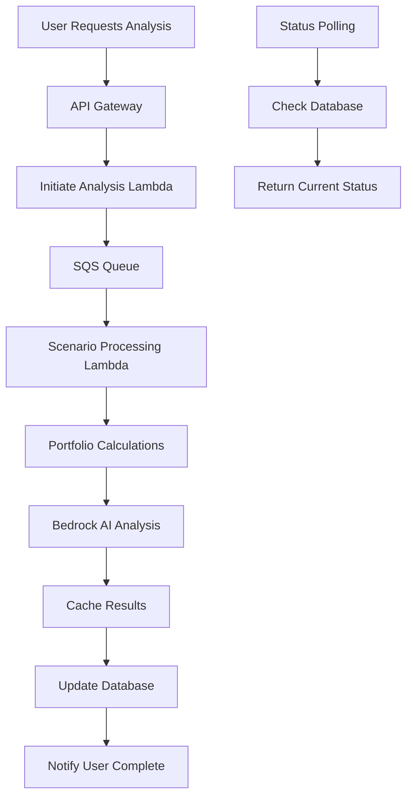

# Stage 3: AI Integration and Scenario Analysis (Weeks 5-6)

> **Code Disclaimer**: All code examples are architectural references. Use AI tools (Claude, Cursor, GitHub Copilot, Warp) to generate, analyze, and implement production code based on these specifications.

## Overview

Stage 3 implements EconLens's core value proposition: AI-powered portfolio scenario analysis with comprehensive structured data formatting. You'll integrate AWS Bedrock for intelligent insights using advanced prompt engineering, build the economic scenario calculation engine, and implement async processing for complex analysis workflows.

**Enhanced AI Features**: This stage includes a complete AI analysis framework with structured input/output formatting, quality validation, and personalized educational insights optimized for different user types and experience levels.

**Duration**: 2 weeks (14 days)  
**Primary AI Tools**: Bedrock integration (Claude + Cursor), Complex algorithms (Claude), Performance optimization (all tools)  
**Key Outcome**: Complete AI-powered scenario analysis with intelligent, quality-controlled portfolio recommendations

## Prerequisites

✅ **Stage 2 Completed**
- Serverless architecture operational
- Portfolio CRUD with file upload working
- Comprehensive monitoring in place
- Performance baselines established

✅ **AI Integration Requirements**
- AWS Bedrock access enabled in account
- Budget controls configured for AI costs
- Understanding of prompt engineering principles
- Review of `docs/05-Portfolio-Engine-and-AI-Scenarios.md`

## Learning Objectives

### AI/ML Services Mastery
- **AWS Bedrock**: Model selection, prompt engineering, cost optimization
- **Claude API**: Advanced prompt engineering for financial analysis
- **AI Response Processing**: Quality validation, error handling, fallback strategies
- **Cost Management**: AI usage monitoring and budget controls

### Advanced AWS Patterns
- **SQS + Lambda**: Async processing patterns for long-running tasks
- **ElastiCache**: Advanced caching strategies for expensive computations
- **Secrets Manager**: Secure API key management and rotation
- **Step Functions**: Workflow orchestration (optional advanced topic)

### Financial Engineering
- **Scenario Modeling**: Economic factor impact calculations
- **Portfolio Mathematics**: Risk assessment, correlation analysis
- **Data Validation**: Financial data quality and consistency checks

## Week 5: Scenario Engine Foundation (Days 29-35)

### Day 29-30: Economic Scenario Framework

#### **Task 5.1: Scenario Data Model Implementation**

**Using Cursor AI:**
> "Implement the complete scenario data model based on docs/05-Portfolio-Engine-and-AI-Scenarios.md. Include all 5 economic scenarios with their impact factors and calculation methodologies."

**Database Schema Updates:**
```sql
-- Generate complete schema with Cursor
-- Reference docs/05-Portfolio-Engine-and-AI-Scenarios.md

CREATE TABLE scenario_impact_factors (
    id UUID PRIMARY KEY DEFAULT gen_random_uuid(),
    scenario_id UUID NOT NULL REFERENCES scenarios(id),
    asset_category VARCHAR(100) NOT NULL,
    impact_min DECIMAL(6,2) NOT NULL,
    impact_max DECIMAL(6,2) NOT NULL,
    impact_median DECIMAL(6,2) NOT NULL,
    volatility_multiplier DECIMAL(4,2) DEFAULT 1.0,
    correlation_adjustment DECIMAL(4,2) DEFAULT 0.0,
    primary_drivers TEXT[],
    confidence_factors JSONB DEFAULT '{}',
    created_at TIMESTAMP WITH TIME ZONE DEFAULT CURRENT_TIMESTAMP
);

-- Additional tables for scenario calculations, caching, etc.
```

**Scenario Seed Data:**
```typescript
// Generate with Cursor - backend/database/seeds/scenarios.ts
export const economicScenarios: ScenarioDefinition[] = [
  {
    id: 'recession_moderate',
    name: 'Moderate Economic Recession',
    description: 'Typical economic downturn with GDP decline, rising unemployment...',
    category: 'Economic Downturn',
    severity: 7,
    durationMonths: 18,
    parameters: {
      gdpChange: -3.5,
      unemploymentChange: 2.8,
      inflationChange: -0.8
    },
    assetImpacts: {
      // Complete impact factors for all asset categories
    }
  },
  // Additional 4 scenarios...
];
```

#### **Task 5.2: Portfolio Calculation Engine**

**Core Calculation Logic:**
```typescript
// Generate with Cursor - backend/src/services/scenario-calculator.ts
export class ScenarioCalculator {
  async calculatePortfolioImpact(
    portfolio: Portfolio,
    scenario: Scenario
  ): Promise<ScenarioResult> {
    
    // 1. Asset-level impact calculation
    const assetImpacts = await this.calculateAssetImpacts(portfolio.assets, scenario);
    
    // 2. Portfolio-level aggregation
    const portfolioImpact = this.aggregatePortfolioImpact(assetImpacts);
    
    // 3. Risk adjustment calculations
    const riskAdjustedImpact = this.applyRiskAdjustments(portfolioImpact, scenario);
    
    // 4. Confidence scoring
    const confidenceScore = this.calculateConfidenceScore(portfolio, scenario);
    
    return {
      scenarioId: scenario.id,
      portfolioId: portfolio.id,
      totalImpactPercentage: riskAdjustedImpact.totalImpact,
      assetImpacts: assetImpacts,
      confidenceScore: confidenceScore,
      calculationMetadata: {
        timestamp: new Date(),
        version: '1.0',
        processingTimeMs: performance.now() - startTime
      }
    };
  }
  
  private async calculateAssetImpacts(
    assets: PortfolioAsset[],
    scenario: Scenario
  ): Promise<AssetImpact[]> {
    // Detailed implementation based on docs/05-Portfolio-Engine-and-AI-Scenarios.md
  }
}
```

### Day 31-32: AWS Bedrock Integration

#### **Task 5.3: Bedrock Service Setup**

**Using Claude for Strategy:**
> "Design the optimal AWS Bedrock integration strategy for EconLens portfolio analysis. Consider model selection (Claude vs Titan), cost optimization, prompt engineering best practices, and error handling for financial AI use cases."

**Bedrock Configuration:**
```typescript
// Generate with Cursor - backend/src/services/bedrock-client.ts
export class BedrockClient {
  private client: BedrockRuntimeClient;
  private modelConfig: ModelConfiguration;
  
  constructor() {
    this.client = new BedrockRuntimeClient({
      region: process.env.AWS_REGION,
      credentials: fromNodeProviderChain()
    });
    
    this.modelConfig = {
      modelId: 'anthropic.claude-3-5-sonnet-20241022-v2:0', // Latest Claude 3.5 Sonnet
      maxTokens: 8000,                     // Increased for comprehensive analysis
      temperature: 0.3,
      topP: 0.9
    };
  }
  
  async generateInsights(
    portfolio: Portfolio,
    scenario: Scenario,
    calculationResults: ScenarioResult,
    userProfile: UserProfile
  ): Promise<AIInsights> {
    
    // Use enhanced structured prompt from Portfolio-Data-Specification.md
    const prompt = this.buildStructuredAnalysisPrompt(
      portfolio, scenario, calculationResults, userProfile
    );
    
    try {
      const response = await this.client.invokeModel({
        modelId: this.modelConfig.modelId,
        contentType: 'application/json',
        body: JSON.stringify({
          anthropic_version: 'bedrock-2023-05-31',
          max_tokens: this.modelConfig.maxTokens,
          temperature: this.modelConfig.temperature,
          messages: [{
            role: 'user',
            content: prompt
          }]
        })
      });
      
      const parsedResponse = this.parseAIResponse(response);
      
      // Enhanced quality validation
      const validationResult = await this.validateResponseQuality(
        parsedResponse, portfolio, scenario, userProfile
      );
      
      if (!validationResult.isValid) {
        throw new Error(`AI response quality below threshold: ${validationResult.issues.join(', ')}`);
      }
      
      return parsedResponse;
      
    } catch (error) {
      return this.handleBedrockError(error, portfolio, scenario);
    }
  }
  
  private buildStructuredAnalysisPrompt(
    portfolio: Portfolio,
    scenario: Scenario,
    calculationResults: ScenarioResult,
    userProfile: UserProfile
  ): string {
    
    // Enhanced prompt building using Portfolio-Data-Specification.md framework
    const promptBuilder = new AIPromptBuilder();
    
    const analysisInput: AIAnalysisInput = {
      portfolio: {
        name: portfolio.name,
        totalValue: portfolio.totalValue,
        currency: portfolio.currency,
        assetCount: portfolio.assets.length,
        createdDate: portfolio.createdAt.toISOString(),
        lastModified: portfolio.updatedAt.toISOString()
      },
      
      assetAllocation: {
        summary: this.generateAllocationSummary(portfolio.assets),
        detailedBreakdown: this.formatAssetsForAI(portfolio.assets),
        diversificationMetrics: portfolio.riskProfile,
        riskCharacteristics: this.calculateRiskCharacteristics(portfolio.assets)
      },
      
      scenarioContext: {
        scenarioName: scenario.name,
        scenarioDescription: scenario.description,
        economicParameters: scenario.parameters,
        historicalContext: scenario.historicalPrecedents,
        timeHorizon: `${scenario.durationMonths} months`
      },
      
      calculationResults: {
        totalImpactPercentage: calculationResults.totalImpactPercentage,
        totalImpactDollar: calculationResults.totalImpactDollar || 
          (calculationResults.totalImpactPercentage / 100) * portfolio.totalValue,
        confidenceScore: calculationResults.confidenceScore,
        assetLevelImpacts: calculationResults.assetImpacts,
        portfolioRiskChanges: this.calculateRiskChanges(calculationResults)
      },
      
      userProfile: {
        investmentExperience: userProfile.investmentExperience,
        riskTolerance: userProfile.riskTolerance,
        userType: userProfile.userType,
        investmentHorizon: userProfile.investmentHorizon || 'medium',
        preferredAnalysisDepth: userProfile.preferredAnalysisDepth || 'detailed'
      }
    };
    
    return promptBuilder.buildComprehensivePrompt(analysisInput);
  }
  
  private formatAssetsForAI(assets: PortfolioAsset[]): AIFormattedAsset[] {
    return assets.map(asset => ({
      symbol: asset.symbol,
      name: asset.name,
      description: this.generateAssetDescription(asset),
      allocationPercentage: asset.allocationPercentage,
      dollarAmount: asset.dollarAmount,
      assetClass: this.getHumanReadableAssetClass(asset.assetCategory),
      riskLevel: asset.riskRating || this.calculateAssetRiskLevel(asset),
      volatilityDescription: this.getVolatilityDescription(asset),
      economicSensitivity: this.assessEconomicSensitivity(asset),
      keyCharacteristics: this.generateKeyCharacteristics(asset)
    }));
  }
}
```

#### **Task 5.4: Prompt Engineering Framework**

**Master Prompt Template:**
```typescript
// Generate sophisticated prompt with Claude assistance
class PromptBuilder {
  buildAnalysisPrompt(
    portfolio: Portfolio,
    scenario: Scenario,
    calculationResults: ScenarioResult,
    userProfile: UserProfile
  ): string {
    
    return `You are EconLens AI, a sophisticated financial analyst specializing in portfolio risk assessment and economic scenario analysis. Provide educational insights to help investors understand potential portfolio impacts.

PORTFOLIO CONTEXT:
- Name: ${portfolio.name}
- Total Value: ${this.formatCurrency(portfolio.totalValue)}
- Asset Count: ${portfolio.assets.length}
- Risk Profile: ${portfolio.riskProfile.overallRiskScore}/10
- Diversification Score: ${portfolio.riskProfile.concentrationRisk}/10

ASSET ALLOCATION:
${this.formatAssetAllocation(portfolio.assets)}

ECONOMIC SCENARIO: ${scenario.name}
${scenario.description}

Key Economic Parameters:
${this.formatScenarioParameters(scenario)}

CALCULATED IMPACT ANALYSIS:
- Total Portfolio Impact: ${calculationResults.totalImpactPercentage}%
- Confidence Level: ${calculationResults.confidenceScore}%

Asset-Level Impact Breakdown:
${this.formatAssetImpacts(calculationResults.assetImpacts)}

USER CONTEXT:
- Investment Experience: ${userProfile.investmentExperience}
- Risk Tolerance: ${userProfile.riskTolerance}
- User Type: ${userProfile.userType}

ANALYSIS REQUIREMENTS:
1. Provide clear, educational explanations suitable for ${userProfile.userType} investors
2. Focus on WHY these impacts occur, not just WHAT the numbers show
3. Identify 2-3 key risks and 2-3 potential opportunities
4. Suggest general risk management strategies (not specific financial advice)
5. Maintain encouraging but realistic tone
6. Use analogies and examples when helpful for comprehension

RESPONSE STRUCTURE:
## Portfolio Impact Summary
[2-3 sentences explaining overall impact and confidence level]

## Key Risks to Monitor
[3 specific risks with clear explanations of why they matter]

## Potential Opportunities  
[2-3 opportunities that might arise from this scenario]

## Risk Management Considerations
[General strategies for managing identified risks - educational only]

## Historical Context
[Brief comparison to similar past economic events]

IMPORTANT DISCLAIMERS:
- This is educational analysis, not personalized financial advice
- Past performance doesn't guarantee future results  
- Consider consulting financial professionals for investment decisions
- Economic scenarios are hypothetical and may not reflect actual outcomes

Generate comprehensive, actionable insights that help the user understand their portfolio's position in this economic scenario.`;
  }
}
```

### Day 33-34: Async Processing Architecture

#### **Task 5.5: SQS + Lambda Processing Pipeline**

**Processing Workflow:**


**SQS Infrastructure:**
```typescript
// Generate with Cursor - infrastructure/lib/stacks/processing-stack.ts
export class ProcessingStack extends Stack {
  public readonly analysisQueue: sqs.Queue;
  public readonly processingFunction: lambda.Function;
  public readonly dlQueue: sqs.Queue;
  
  constructor(scope: Construct, id: string) {
    
    // Dead Letter Queue for failed processing
    this.dlQueue = new sqs.Queue(this, 'AnalysisDLQ', {
      queueName: 'econlens-analysis-dlq',
      retentionPeriod: Duration.days(14)
    });
    
    // Main processing queue
    this.analysisQueue = new sqs.Queue(this, 'AnalysisQueue', {
      queueName: 'econlens-scenario-analysis',
      visibilityTimeout: Duration.minutes(15), // Max processing time
      deadLetterQueue: {
        queue: this.dlQueue,
        maxReceiveCount: 3
      }
    });
    
    // Processing Lambda function
    this.processingFunction = new lambda.Function(this, 'ProcessingFunction', {
      runtime: lambda.Runtime.NODEJS_20_X,  // Updated to Node.js 20
      // Configuration for long-running analysis
      timeout: Duration.minutes(15),
      memorySize: 2048,
      environment: {
        BEDROCK_MODEL_ID: 'anthropic.claude-3-5-sonnet-20241022-v2:0',
        CACHE_CLUSTER_ENDPOINT: '[REDIS_ENDPOINT]',
        NODE_OPTIONS: '--enable-source-maps --max-old-space-size=1024'
      }
    });
    
    // SQS trigger
    this.processingFunction.addEventSource(
      new lambdaEventSources.SqsEventSource(this.analysisQueue, {
        batchSize: 1, // Process one analysis at a time
        reportBatchItemFailures: true
      })
    );
  }
}
```

#### **Task 5.6: ElastiCache Integration**

**Caching Strategy:**
```typescript
// Generate with Cursor - backend/src/services/cache-manager.ts
export class CacheManager {
  private redis: Redis;
  
  constructor() {
    this.redis = new Redis({
      host: process.env.CACHE_CLUSTER_ENDPOINT,
      port: 6379,
      retryDelayOnFailover: 100,
      maxRetriesPerRequest: 3
    });
  }
  
  async cacheScenarioResult(
    portfolioId: string,
    scenarioId: string, 
    result: ScenarioAnalysisResult
  ): Promise<void> {
    
    const cacheKey = this.buildCacheKey(portfolioId, scenarioId);
    const ttl = 24 * 60 * 60; // 24 hours
    
    await this.redis.setex(
      cacheKey,
      ttl,
      JSON.stringify(result)
    );
  }
  
  async getCachedResult(
    portfolioId: string,
    scenarioId: string
  ): Promise<ScenarioAnalysisResult | null> {
    
    const cacheKey = this.buildCacheKey(portfolioId, scenarioId);
    const cached = await this.redis.get(cacheKey);
    
    if (cached) {
      return JSON.parse(cached);
    }
    
    return null;
  }
  
  private buildCacheKey(portfolioId: string, scenarioId: string): string {
    return `analysis:${portfolioId}:${scenarioId}`;
  }
}
```

### Day 35: Integration and Testing

#### **Task 5.7: End-to-End Workflow Integration**

**Complete Analysis Workflow:**
1. **Initiate Analysis**: API endpoint queues analysis job
2. **Process Request**: Lambda processes portfolio + scenario
3. **Generate AI Insights**: Bedrock creates detailed analysis
4. **Cache Results**: Store in ElastiCache and database
5. **Status Updates**: Real-time status via polling endpoint
6. **Result Delivery**: Complete analysis returned to frontend

**Integration Testing:**
```typescript
// Generate comprehensive test suite with Claude assistance
describe('Scenario Analysis Integration', () => {
  test('complete analysis workflow', async () => {
    // 1. Create test portfolio
    // 2. Initiate scenario analysis
    // 3. Wait for processing completion
    // 4. Validate calculation accuracy
    // 5. Verify AI insights quality
    // 6. Check caching functionality
  });
});
```

## Week 6: AI Quality and Production Readiness (Days 36-42)

### Day 36-37: AI Response Quality Assurance

#### **Task 6.1: AI Response Validation Framework**

**Quality Control System:**
```typescript
// Generate with Cursor - backend/src/services/ai-validator.ts
export class AIResponseValidator {
  validateInsightQuality(insights: AIInsights): ValidationResult {
    const checks = [
      this.validateLength(insights),
      this.validateStructure(insights),
      this.validateFinancialAccuracy(insights),
      this.validateTone(insights),
      this.validateActionability(insights)
    ];
    
    return {
      isValid: checks.every(check => check.passes),
      issues: checks.filter(check => !check.passes),
      qualityScore: this.calculateQualityScore(checks)
    };
  }
  
  private validateFinancialAccuracy(insights: AIInsights): ValidationCheck {
    // Check for common financial misconceptions
    // Validate that recommendations are reasonable
    // Ensure no specific financial advice is given
    // Verify educational tone is maintained
  }
  
  private validateActionability(insights: AIInsights): ValidationCheck {
    // Ensure insights provide concrete value
    // Check that risks and opportunities are specific
    // Validate that recommendations are implementable
  }
}
```

#### **Task 6.2: AI Cost Optimization**

**Using Claude for Cost Analysis:**
> "Analyze AWS Bedrock costs for portfolio analysis use case. Design cost optimization strategies including prompt caching, response caching, batch processing, and model selection optimization."

**Cost Control Implementation:**
```typescript
export class BedrockCostManager {
  private monthlyBudget: number = 100; // $100/month limit
  private currentSpend: number = 0;
  
  async checkBudget(): Promise<boolean> {
    // Track current month spend
    // Implement circuit breaker if approaching limit
    // Provide degraded service with cached responses
    // Alert on high usage
  }
  
  optimizePromptLength(prompt: string): string {
    // Remove unnecessary whitespace
    // Optimize token usage while maintaining quality
    // Cache similar prompts to avoid regeneration
  }
}
```

### Day 38-39: Advanced Scenario Features

#### **Task 6.3: Portfolio Comparison Analysis**

**Multi-Scenario Comparison:**
```typescript
// Generate with Cursor
export class ScenarioComparer {
  async compareScenarios(
    portfolio: Portfolio,
    scenarios: Scenario[]
  ): Promise<ScenarioComparison> {
    
    // Run analysis for each scenario
    const results = await Promise.all(
      scenarios.map(scenario => 
        this.scenarioCalculator.calculatePortfolioImpact(portfolio, scenario)
      )
    );
    
    // Generate comparative analysis
    const comparison = this.analyzeComparison(results);
    
    // Create AI insights for comparison
    const aiComparison = await this.generateComparisonInsights(
      portfolio, scenarios, results
    );
    
    return {
      portfolio,
      scenarioResults: results,
      comparison,
      aiInsights: aiComparison
    };
  }
}
```

#### **Task 6.4: Historical Backtesting Integration**

**Validation Against Historical Data:**
```typescript
export class BacktestValidator {
  async validateScenarioAccuracy(
    scenario: Scenario,
    historicalPeriod: DateRange
  ): Promise<BacktestResult> {
    
    // Fetch historical market data for period
    // Apply scenario impacts to historical portfolios
    // Compare predicted vs actual performance
    // Calculate accuracy metrics
    // Adjust confidence scores based on validation
  }
}
```

### Day 40-41: Performance Optimization

#### **Task 6.5: Processing Performance Optimization**

**Optimization Strategies:**
1. **Parallel Processing**: Process multiple assets simultaneously
2. **Calculation Caching**: Cache intermediate calculations
3. **Smart Batching**: Batch similar analysis requests
4. **Memory Optimization**: Efficient data structures for large portfolios

**Using Claude for Algorithm Optimization:**
> "Optimize the portfolio scenario calculation algorithm for performance. Current implementation processes 50 assets in ~45 seconds. Target: <15 seconds for same portfolio size."

#### **Task 6.6: Database Performance Tuning**

**Database Optimizations:**
```sql
-- Generate optimized indexes with AI assistance
CREATE INDEX CONCURRENTLY idx_portfolio_assets_category 
ON portfolio_assets(asset_category, portfolio_id);

CREATE INDEX CONCURRENTLY idx_scenario_results_lookup
ON scenario_results(portfolio_id, scenario_id, created_at DESC)
WHERE expires_at > CURRENT_TIMESTAMP;

-- Partitioning for scenario results table
CREATE TABLE scenario_results_monthly PARTITION OF scenario_results
FOR VALUES FROM ('2024-01-01') TO ('2024-02-01');
```

### Day 42: Production Readiness

#### **Task 6.7: Comprehensive Error Handling**

**AI Service Resilience:**
```typescript
export class AIServiceResilience {
  async generateInsightsWithFallback(
    portfolio: Portfolio,
    scenario: Scenario,
    calculationResults: ScenarioResult
  ): Promise<AIInsights> {
    
    try {
      // Primary: AWS Bedrock
      return await this.bedrockClient.generateInsights(
        portfolio, scenario, calculationResults
      );
      
    } catch (error) {
      if (this.isRateLimitError(error)) {
        // Fallback: Cached similar analysis
        return await this.getCachedSimilarAnalysis(portfolio, scenario);
      }
      
      if (this.isBudgetExceededError(error)) {
        // Fallback: Template-based analysis
        return this.generateTemplateAnalysis(portfolio, scenario, calculationResults);
      }
      
      // Ultimate fallback
      return this.getBasicAnalysis(calculationResults);
    }
  }
}
```

## Stage 3 Demo Requirements

### Functional Demo Checklist

#### **Scenario Analysis Engine**
- [ ] All 5 economic scenarios working correctly
- [ ] Portfolio impact calculations accurate and consistent
- [ ] Confidence scoring reflecting analysis quality
- [ ] Processing completes within 2 minutes for typical portfolios
- [ ] Results cached for improved performance

#### **AI-Powered Insights**
- [ ] AI insights generated for all scenarios
- [ ] Insights are relevant, coherent, and actionable
- [ ] Educational tone maintained (no specific financial advice)
- [ ] Quality validation preventing poor responses
- [ ] Cost controls preventing budget overruns

#### **Advanced Features**
- [ ] Multi-scenario comparison working
- [ ] Portfolio risk analysis comprehensive
- [ ] Historical context provided in insights
- [ ] Real-time progress updates during processing
- [ ] Error handling graceful and informative

#### **Performance Requirements**
- [ ] Analysis initiation < 1 second
- [ ] Processing completion < 2 minutes
- [ ] Cache hit rate > 70% for repeat analyses
- [ ] AI response generation < 30 seconds
- [ ] Total workflow < 3 minutes end-to-end

### Technical Validation Checklist

#### **AWS Services Integration**
- [ ] Bedrock integration working reliably
- [ ] SQS message processing robust
- [ ] ElastiCache providing performance benefits
- [ ] Lambda functions optimized for cost/performance
- [ ] Error handling and DLQ processing working

#### **AI Quality Assurance**
- [ ] Response validation catching poor quality outputs
- [ ] Cost tracking within budget limits
- [ ] Prompt engineering optimized for accuracy
- [ ] Fallback systems working when AI unavailable
- [ ] No hallucination or incorrect financial information

#### **Data Quality**
- [ ] Calculation accuracy validated against test cases
- [ ] Scenario parameters reflecting economic reality
- [ ] Asset impact factors reasonable and consistent
- [ ] Portfolio analysis mathematically sound
- [ ] Historical context accurate

## Advanced Features and Extensions

### Real-Time Market Integration (Optional)
- Alpha Vantage API integration for current market data
- Real-time portfolio valuation updates
- Market sentiment analysis integration

### Advanced AI Features (Future)
- Custom scenario creation with AI assistance
- Portfolio optimization recommendations
- Market timing analysis
- Risk-adjusted return projections

## Cost Management

### AI Service Costs
**Expected Monthly Costs:**
- **Bedrock Usage**: $15-30/month (500-1000 analyses)
- **SQS Messages**: $0.50-1.00/month
- **ElastiCache**: $15-20/month (t3.micro)
- **Additional Lambda**: $2-5/month
- **Total Stage 3 Addition**: $32-56/month

**Cost Optimization Strategies:**
- Response caching for 24-48 hours
- Prompt optimization for token efficiency  
- Batch processing for multiple analyses
- Budget alerts at 80% of monthly limit

## Success Criteria

### Technical Success
- **Accuracy**: Scenario calculations within 5% of expected ranges
- **Performance**: 95% of analyses complete within SLA
- **Reliability**: 99%+ success rate for AI insight generation
- **Cost Efficiency**: AI costs <$50/month for MVP usage

### User Experience Success
- **Insight Quality**: 90%+ user satisfaction with AI recommendations
- **Comprehension**: Users understand insights without financial expertise
- **Actionability**: Users can act on recommendations provided
- **Trust**: Users trust the analysis quality and accuracy

## Next Steps: Stage 4 Production Operations

With Stage 3 complete, you have:
✅ Complete AI-powered scenario analysis
✅ Production-ready async processing  
✅ Intelligent caching and cost optimization
✅ Quality-controlled AI insights generation
✅ Advanced portfolio analysis capabilities

**Stage 4** will focus on production operations and scalability:
- Infrastructure as Code with CDK
- CI/CD pipeline automation
- Advanced monitoring and alerting
- Security hardening and compliance
- Performance optimization for scale
- Launch preparation and user onboarding

The AI capabilities from Stage 3 represent the core competitive advantage of EconLens!